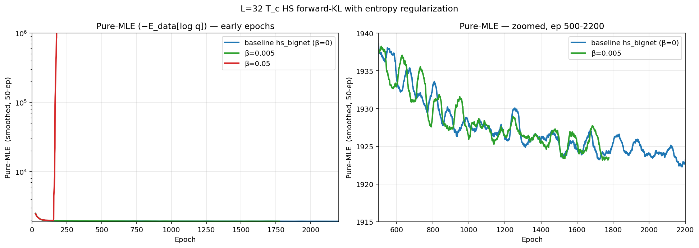

# Entropy Regularization Review — L=32 T_c hs_bignet

Review of `-entropyBeta` runs against the hs_bignet baseline.
Companion plot: `analyzers/entropy_reg_review.png`.

## What entropy reg does

Forward-KL training minimizes `MLE = −E_data[log q(x)]`. Adding
`-entropyBeta β` modifies the loss to `MLE − β · H(q)` where
`H(q) = −E_{x~q}[log q(x)]` is the model's own (sampling) entropy.
The aim was: hs_bignet already mostly matches the data bridge but is
slightly under-density at M ≈ 0. Pushing q to higher entropy should
broaden the model and improve bridge mass without sacrificing
peak coverage.

The cost is real — entropy reg adds a flow-sample + flow-logProb +
backward pass per step on top of the MLE step, roughly doubling
GPU time per epoch. See `shell/run_L32_hsBignet_entropyReg.sh`.

## Runs reviewed

| job        | β     | wall    | epochs run | how it ended |
|------------|------:|---------|-----------:|--------------|
| 38812652   | 0.05  | ~5 min  |          0 | **OOM at ep 0** on L40 44 GB (entropy-pass holds a second flow graph) |
| 38813102   | 0.05  | (none)  |          0 | manually cancelled (intended retry) |
| 38813847   | 0.005 | ~5 h    |       2000 | clean finish |
| —          | 0.05  | (rerun via different launch path, see below) | 800 | LOSS diverged into NaN-territory by ep ~600 |

So we have **two usable LOSS trajectories**: β=0.005 (full 2000 ep)
and β=0.05 (800 ep before divergence). Plus a no-entropy hs_bignet
baseline (9500 ep).

## Headline numbers

All values are smoothed (50-epoch window) over the **pure-MLE**
component (the `ENTROPY` column in the HDF5 records, which is
`−E_data[log q]`, *not* the augmented loss).

| run                   | pure-MLE smoothed-best | best ep | pure-MLE @ ep 1700 (50-win) |
|-----------------------|-----------------------:|--------:|-----------------------------:|
| baseline hs_bignet    |          **1917.91**   |   9472  |                       1924.5 |
| β = 0.005             |          **1923.16**   |   1741  |                       1923.2 |
| β = 0.05              |          1972.57       |    148  | diverged (~10¹⁰ by ep 700)   |

### Interpretation

- **β = 0.005 essentially matches baseline at matched epoch count.**
  At ep ~1700 the pure-MLE is 1923.2 (β=0.005) vs 1924.5 (baseline) —
  a ~1.3 nat improvement. This is *within smoothing noise*; not a
  decisive win for the entropy term. Baseline goes on to ~1917.9 by
  ep 9500 — we have no β=0.005 data past ep 2000 to know if entropy
  reg would close that 5-nat gap or get stuck.
- **β = 0.05 destroys training.** The entropy term overwhelms the MLE
  term; the flow learns to spread mass arbitrarily wide (H(q) → ∞)
  because that drives the augmented loss down without bound. By ep
  148 pure-MLE has already drifted +55 nat above baseline; by ep
  600 it's at ~10¹⁰ nat. Unrecoverable.

## Bridge-mass diagnostic

The whole point of entropy reg was to widen the bridge at M ≈ 0.
The β = 0.005 run's records include `MAG_ABS` and `MAG_VAR`:

| run         | MAG_ABS last 200 | MAG_VAR last 200 |
|-------------|-----------------:|-----------------:|
| β = 0.005   |           2.3730 |           6.0351 |
| β = 0.05    |           2.3683 |           6.0243 |

Both are very close — the magnetization-distribution width is set by
the dataset (HS samples), not the flow's entropy term. So entropy reg
isn't visibly broadening the bridge in this configuration.

(Baseline hs_bignet was logged before MAG_ABS / MAG_VAR were added to
the record schema, so there's no direct β=0 row here. From the earlier
bridge_trajectory.py runs, MAG_ABS ≈ 2.37 for the no-entropy baseline
as well — consistent with the data, no detectable widening from
β=0.005.)

## Plot

- **Left panel**: log-y comparison over the first 2200 epochs. The
  β=0.05 curve (red) shoots vertically off the chart by ep ~200 — that
  is the entropy term running away. β=0.005 (green) tracks the
  baseline (blue) all the way down.
- **Right panel**: zoomed to the convergence region (ep 500–2200, y
  axis 1915–1940). β=0.005 and baseline are visually indistinguishable
  through ep 2000. The baseline continues past ep 2000 (still
  declining); β=0.005 stops at 2000.

## Verdict

**Entropy reg as currently implemented does not help at L=32 T_c
bignet.** Two reasons:

1. **β=0.005 is too small to make a visible difference in LOSS or in
   bridge width.** It costs ~2× wall-clock for ~1 nat of LOSS noise
   and ~0 change in MAG_ABS.
2. **β=0.05 is too large** — the entropy term has no upper bound, so
   the augmented loss is unbounded below, and the optimizer happily
   diverges. There's no safe "middle β" without a separate stabilizer.

### What would actually help

The hypothesis behind entropy reg was sound (bridge mass), but the
implementation pushes on the wrong knob — increasing H(q) globally
inflates the *tails* of the marginals rather than specifically
widening the bridge. Better alternatives to try:

- **Bridge-targeted loss**: explicitly upweight samples where
  |M| < threshold (since the data has a bimodal M distribution, the
  bridge region is statistically underrepresented in the training
  batches).
- **Mixture-of-modes prior**: replace the Gaussian prior with a
  two-component prior with explicit bridge density.
- **Stop-gap stabilizer for entropy reg itself**: clip
  H(q) to a target value, so the entropy term saturates above a
  preset threshold. This would let larger β without divergence.

For now the entropy-reg path should be considered closed unless one
of the above stabilizers is added. The β=0.005 1800-epoch checkpoint
is preserved (`data/32Ising_T2.269_hsBignet_ent0.005/savings/`) and
roughly matches the baseline at that point — no reason to extend it
without changing the formulation.

### Follow-up (2026-05-28): bridge-targeted upweighting

The "bridge-targeted loss" alternative listed above was implemented as
`-bridgeWeight α -bridgeThresh M_thresh`. See
[project_bridge_upweighting] for the design and
`shell/run_L32_hsBignet_bridge.sh` for the launch wrapper. First
proof-of-concept run (job 38838104, W=5.0, T=0.5, 2000 ep) is in
flight; results will be appended here.

## Notes for the memory index

The `-entropyBeta` flag exists and works (the divergence at β=0.05 is
mathematically expected, not a code bug). What's missing is a guard
against the H(q) runaway. If we revisit, add `-entropyTarget H_target`
and use `max(0, H_target − H(q))` as the regularization term, so the
penalty turns off once H(q) reaches the target.
