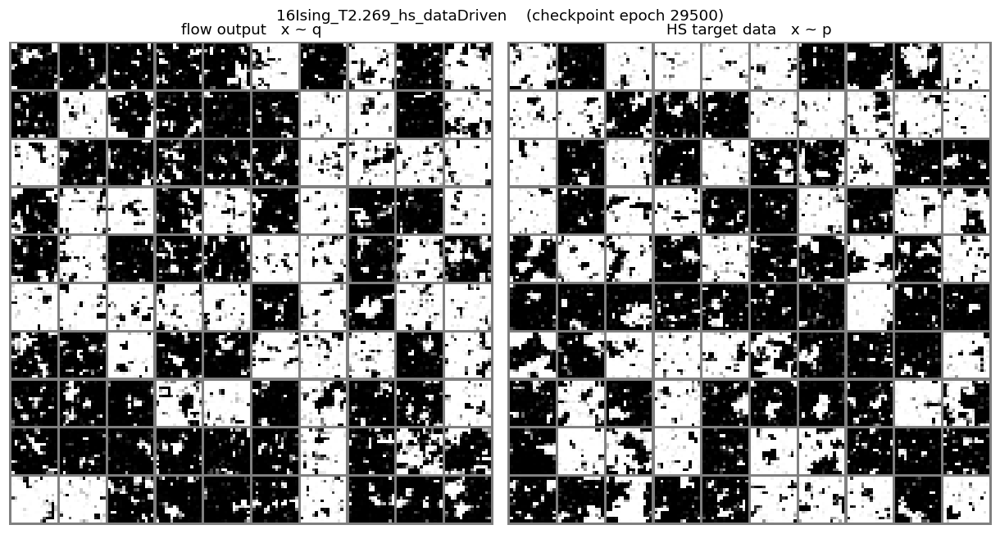
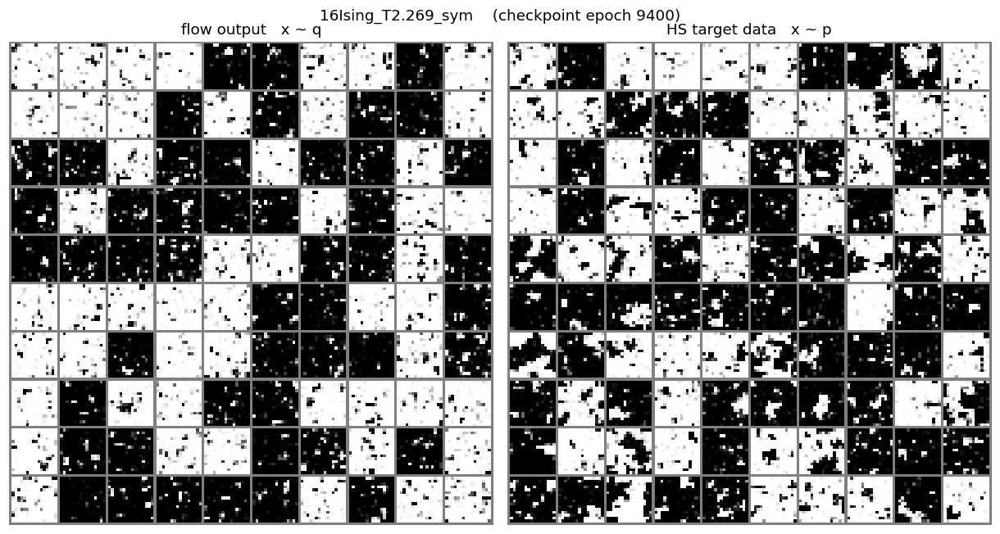
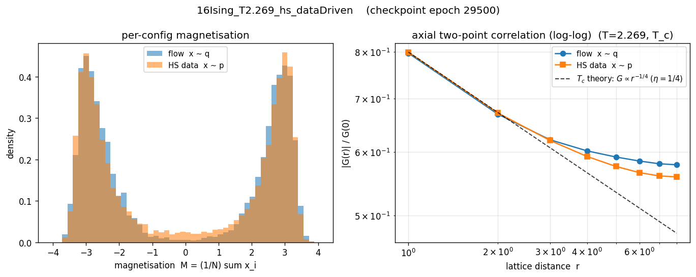
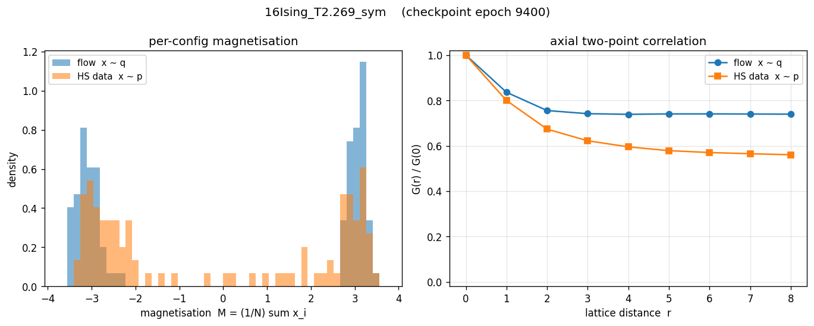

# Ising L=16 — Concise Report (T=2.269)

## Summary — everything in one table

Superset of the two tables above: free energy / energy / entropy **and**
both KL directions, for exact theory, the two **datasets**, and the best
trained flow of each mode. Discrete rows are grouped first.

Font marks where each number comes from (Markdown has no portable text
colour, so font carries the distinction):

- **bold** — exact theory (Onsager / `exactz.md`).
- *italic* — training-measured, read from the run's HDF5 records. A
  reverse-KL run logs `F/E/S` of the flow; a forward-KL run logs only
  `S` (the MLE loss `-E_data[log q]`) — its `F/E` are N/A.
- plain — sample-measured: a dataset sample-average, or the post-hoc
  flow diagnostic that draws `x ~ q` (the only way to get a forward-KL
  run's model-side `F/E`).

| Source                                   |  Picture   |    F (-lnZ)   |       E       |      S       | KL(q‖p)  |  KL(p‖q)  |
| :--------------------------------------- | :--------: | :-----------: | :-----------: | :----------: | :------: | :-------: |
| **Exact (theory)**                       |  discrete  | **-238.6423** | **-167.4130** | **71.2292**  |    —     |     —     |
| MCMC dataset (Wolff)                     |  discrete  |      N/A      |   -163.9458   |     N/A      |    —     |     —     |
| **Exact (theory)**                       | continuous | **-592.8757** | **-118.5950** | **474.2808** |  **0**   |   **0**   |
| HS dataset (x ~ p_HS)                    | continuous |      N/A      |   -118.5949   |   474.2808   |    —     |     —     |
| *sym — training*                         | continuous |  *-590.9911*  |  *-131.9934*  |  *458.9977*  | *1.8846* |    N/A    |
| sym — diagnostic (epoch 9400)            | continuous |   -590.4449   |   -129.4680   |   460.9769   |   N/A    |  10.8203  |
| *hs_dataDriven — training*               | continuous |      N/A      |      N/A      |  *471.6035*  |   N/A    | *-2.6773* |
| hs_dataDriven — diagnostic (epoch 29500) | continuous |   -587.9043   |   -108.1010   |   479.8033   |  4.9715  |    N/A    |

Notes:
- Each flow gets **two rows** — *training* and *diagnostic* — the same run
  as the optimiser logged it vs. as a fresh `x ~ q` sample measures it. For
  a converged reverse-KL run the two should agree.
- **Datasets**: `E` is a plain sample average; `F = -lnZ` cannot be
  estimated from samples (needs the partition function) → N/A. HS
  `S_c = E_p[A] + lnZ_c` is an MC entropy estimate (uses exact `lnZ_c`);
  MCMC gives only `E_d`.
- `KL(q‖p)` / `KL(p‖q)`: each direction appears once per flow. The
  *training* row carries the **on-objective** KL — the one that mode
  minimises, recovered from the loss (reverse-KL `KL(q‖p)=loss+lnZ_c`;
  forward-KL `KL(p‖q)=loss-H(p_HS)`). The *diagnostic* row carries the
  **off-objective** KL, which training cannot see. `—` = not applicable
  (theory-discrete / dataset rows); `0` for continuous theory.
- A **negative** training-row `KL(p‖q)` means the MLE loss dipped below
  the entropy floor `H(p_HS)` — training-set overfitting (seen at L=8/16).
- The per-run breakdown for *all* methods stays in the flow-diagnostic
  table above; this summary keeps only the best of each mode.

## Flow samples — flow output (x ~ q) vs HS target data (x ~ p)

_Each panel pair: left = configurations the trained flow generates,_
_right = HS samples from the true target. Same sigmoid(2x) rendering._

### hs_dataDriven

### sym

## Flow correlations — magnetisation P(M) and two-point G(r)

_Left: per-config magnetisation distribution. Right: normalised_
_axial two-point correlation G(r)/G(0). Flow (q) vs HS data (p)._

### hs_dataDriven

### sym

