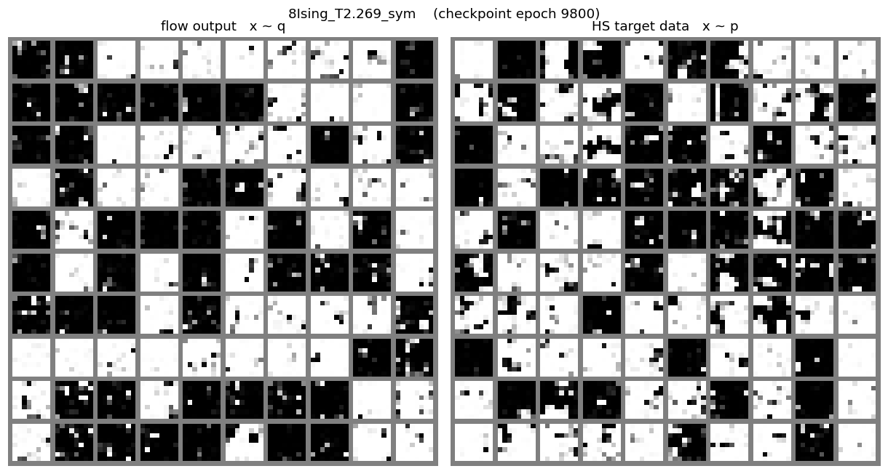
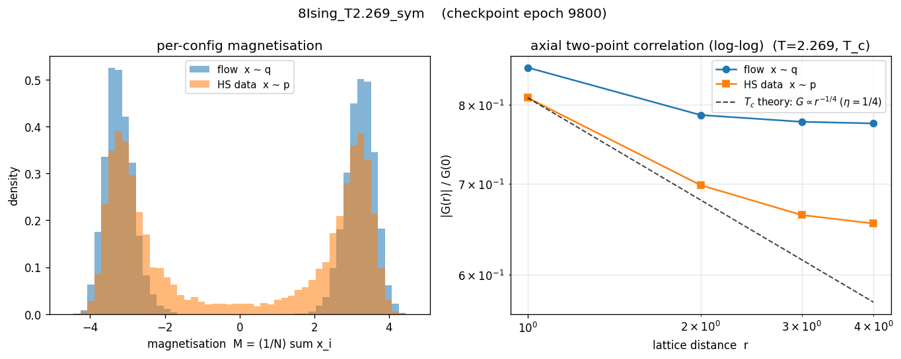

# Ising L=8 — Concise Report (T=2.269)

## Summary — everything in one table

Superset of the two tables above: free energy / energy / entropy **and**
both KL directions, for exact theory, the two **datasets**, and the best
trained flow of each mode. Discrete rows are grouped first.

Font marks where each number comes from (Markdown has no portable text
colour, so font carries the distinction):

- **bold** — exact theory (Onsager / `exactz.md`).
- *italic* — training-measured, read from the run's HDF5 records. A
  reverse-KL run logs `F/E/S` of the flow; a forward-KL run logs only
  `S` (the MLE loss `-E_data[log q]`) — its `F/E` are N/A.
- plain — sample-measured: a dataset sample-average, or the post-hoc
  flow diagnostic that draws `x ~ q` (the only way to get a forward-KL
  run's model-side `F/E`).

Rows are grouped by training objective — **reference → reverse-KL →
forward-KL** — separated by `══════` double-line dividers inside the
table (same convention as the L=32 report).

| Source                                       |    F (-lnZ)    |       E       |       S       |  KL(q‖p) |  KL(p‖q)  |
| :------------------------------------------- | :------------: | :-----------: | :-----------: | :------: | :-------: |
| **═══ Reference ═══**                         | ══════════════ | ═════════════ | ═════════════ | ════════ | ═════════ |
| **Exact (theory, discrete)**                 |  **-60.1418**  |  **-43.4459** |  **16.6959**  |    —     |     —     |
| MCMC dataset (Wolff)                         |      N/A       |    -42.0611   |      N/A      |    —     |     —     |
| **Exact (theory, continuous)**               | **-148.6550**  |  **-30.3860** |  **118.2690** |  **0**   |   **0**   |
| HS dataset (x ~ p_HS)                        |      N/A       |    -30.3860   |    118.2690   |    —     |     —     |
| **═══ Reverse-KL ═══**                        | ══════════════ | ═════════════ | ═════════════ | ════════ | ═════════ |
| *sym — training*                             |  *-148.2645*   |  *-33.8592*   |  *114.4052*   | *0.3906* |    N/A    |
| sym — diagnostic (epoch 9800)                |   -147.9424    |   -33.0950    |   114.8473    |   N/A    |   2.0001  |
| *long9800_pathgrad — training (sm best ep ~9486)* |  *-148.1175*  |  *-32.8137*   |  *115.3037*   | *0.5375* |    N/A    |
| **═══ Forward-KL ═══**                        | ══════════════ | ═════════════ | ═════════════ | ════════ | ═════════ |
| *hs_dataDriven — training*                   |      N/A       |     N/A       |  *116.1207*   |   N/A    | *-2.1483* |
| hs_dataDriven — diagnostic (epoch 27000)     |   -147.3005    |   -27.3997    |    119.9008   |  1.3545  |    N/A    |

Notes:
- Each flow gets **two rows** — *training* and *diagnostic* — the same run
  as the optimiser logged it vs. as a fresh `x ~ q` sample measures it. For
  a converged reverse-KL run the two should agree.
- **Datasets**: `E` is a plain sample average; `F = -lnZ` cannot be
  estimated from samples (needs the partition function) → N/A. HS
  `S_c = E_p[A] + lnZ_c` is an MC entropy estimate (uses exact `lnZ_c`);
  MCMC gives only `E_d`.
- `KL(q‖p)` / `KL(p‖q)`: each direction appears once per flow. The
  *training* row carries the **on-objective** KL — the one that mode
  minimises, recovered from the loss (reverse-KL `KL(q‖p)=loss+lnZ_c`;
  forward-KL `KL(p‖q)=loss-H(p_HS)`). The *diagnostic* row carries the
  **off-objective** KL, which training cannot see. `—` = not applicable
  (theory-discrete / dataset rows); `0` for continuous theory.
- A **negative** training-row `KL(p‖q)` means the MLE loss dipped below
  the entropy floor `H(p_HS)` — training-set overfitting (seen at L=8/16).
- The per-run breakdown for *all* methods stays in the flow-diagnostic
  table above; this summary keeps only the best of each mode.
- **Path-gradient / STL extension (2026-06-03)**. Compared against
  the existing `sym` baseline directly (rather than a separately-trained
  matched-pair), one new STL run with otherwise identical hyperparameters
  (`-symmetry -skipHMC`, default arch, batch=128, savePeriod=100) but
  `-pathGrad` on (Roeder 2017 / Vaitl 2024 "sticking the landing":
  drops the explicit-θ score-function term of the reparametrized
  gradient, leaving only the path term). Folder: `..._long9800_pathgrad`,
  job 39354926, 9800 epochs to match the `sym` training length.
  Provisional finding from the earlier 5000-ep matched-pair pilot
  (since superseded and deleted): STL reaches lower smoothed-best F
  (-148.08 vs -147.90) and ~20% lower per-epoch trajectory std at
  matched epoch — both predicted STL benefits confirmed at L=8.
  Final 9800-ep STL result (job 39354926, completed in 1h18m):
  smoothed-best F = -148.1175 (KL_rev = 0.5375), late-window std =
  0.085 over ep 8800-9000. Both improve modestly on the 5000-ep
  pilot (F = -148.08, KL = 0.573, std = 0.089) — STL is still
  drifting slightly downward at 9800 ep, but the gap vs `sym`'s
  smoothed-best (KL ~0.66) is now ~0.13 nat. The on-objective
  asymptote at L=8 is plausibly KL ~0.5 for the default-arch flow.
  **Caveat on reading the LOSS column for STL**: under `-pathGrad`,
  `learn.py` logs the optimization target (`-E[log p]` for the STL
  gradient identity), not `F` — for STL rows compute `F = ENERGY -
  ENTROPY` from HDF5 directly; the training-row `KL(q‖p)` in this
  table is `F + lnZ_c`, not `LOSS + lnZ_c`. See memory
  [project_loss_not_comparable_across_modes].
- **L=32 STL extension in flight** (job 39351158, A100-80G,
  5000 ep b=128 bignet, folder `..._pathgrad_bignet_long`). At
  matched 1950 ep the b=128 STL pilot reached KL=10.75 vs baseline
  11.22 — small win, asymptote still open. The 5000-ep run settles
  the question for L=32.

## Flow samples — flow output (x ~ q) vs HS target data (x ~ p)

_Each panel pair: left = configurations the trained flow generates,_
_right = HS samples from the true target. Same sigmoid(2x) rendering._
_Ordered to match the summary table: reverse-KL → forward-KL._

### sym  *(reverse-KL)*

### hs_dataDriven  *(forward-KL)*

## Flow correlations — magnetisation P(M) and two-point G(r)

_Left: per-config magnetisation distribution. Right: normalised_
_axial two-point correlation |G(r)|/G(0) on **log-log axes**, with_
_a dashed `G ∝ r^(-η)` reference line (η=1/4, Onsager) anchored at_
_r=1 of the HS data. Flow (q) vs HS data (p)._
_Ordered to match the summary table: reverse-KL → forward-KL._

### sym  *(reverse-KL)*

### hs_dataDriven  *(forward-KL)*

