# Ising L=32 — Concise Report (T=2.269)

> **2026-05-28 update.** Two bodies of work since the original edition
> are merged into this single report (the prior `_v2.md` fork has been
> removed):
>
> - **Bridge-targeted upweighting** (`-bridgeWeight`) — replacement
>   for the failed `-entropyBeta` approach. First run lands within
>   ~1% of data on three structural statistics (`mag_abs_q`, `xi_q`,
>   `G(L/2)/G(0)`) at the cost of ≈6 nat KL in both directions.
> - **Phase2 anchor-confusion fix** — the old phase2 diagnostic row
>   was scoring an anchor `epoch9500.saving` left in the savings
>   folder, not the actual phase2 ep1500 checkpoint. Corrected
>   re-diagnostic (job 38843546) has landed and the summary table /
>   structural-reading table now carry the real phase2 numbers.

## Summary — everything in one table

Superset of the two tables above: free energy / energy / entropy **and**
both KL directions, for exact theory, the two **datasets**, and the best
trained flow of each mode. Rows are grouped by training objective —
**reference → reverse-KL → forward-KL → mixed-objective** — separated by
`══════` double-line dividers inside the table.

Font marks where each number comes from (Markdown has no portable text
colour, so font carries the distinction):

- **bold** — exact theory (Onsager / `exactz.md`).
- *italic* — training-measured, read from the run's HDF5 records. A
  reverse-KL run logs `F/E/S` of the flow; a forward-KL run logs only
  `S` (the MLE loss `-E_data[log q]`) — its `F/E` are N/A.
- plain — sample-measured: a dataset sample-average, or the post-hoc
  flow diagnostic that draws `x ~ q` (the only way to get a forward-KL
  run's model-side `F/E`).

### Architectures used at L=32

| Arch    | nlayers | nhidden | trainable params (RNVP) | Used by                                              |
| :------ | ------: | ------: | ----------------------: | :--------------------------------------------------- |
| default |      10 |      64 |              1,780,400  | sym, sym_longer, hs_dataDriven                       |
| bignet  |      16 |     128 |             10,938,240  | sym_bignet_ext, **pathgrad_bignet_long_ext (STL)**, hs_bignet, jsLoss_bignet_long, phase2_finetune, **bridge_w5.0t0.5** |

All rows use `nmlp=3`, `nrepeat=1`, `-symmetry`. Bignet ≈ 6.1× the param
count of default. Earlier intermediate "midbig" arch (nlayers=12,
nhidden=96, 3.74M params) was tried at L=32 and L=16 but produced
non-monotonic results (default beats midbig at L=16 T_c by 1.6 nat;
midbig much worse than bignet at L=32); discarded — capacity scaling
turns out to be binary at this problem size, not graded
(see [project_l32_bignet_fix]).

| Source                          |    F (-lnZ)    |       E       |       S       | KL(q‖p) | KL(p‖q) |
| :------------------------------ | :------------: | :-----------: | :-----------: | :-----: | :-----: |
| **═══ Reference ═══**           | ══════════════ | ═════════════ | ═════════════ | ═══════ | ═══════ |
| **Exact (theory, discrete)**    |  **-952.65**   |  **-668.47**  |  **284.18**   |    —    |    —    |
| MCMC dataset (Wolff)            |      N/A       |    -647.09    |      N/A      |    —    |    —    |
| **Exact (theory, continuous)**  | **-2369.59**   |  **-466.61**  | **1902.98**   |  **0**  |  **0**  |
| HS dataset (x ~ p_HS)           |      N/A       |    -466.61    |   1902.98     |    —    |    —    |
| **═══ Reverse-KL ═══**          | ══════════════ | ═════════════ | ═════════════ | ═══════ | ═══════ |
| *sym_longer — training*         |  *-2357.63*    |  *-535.92*    |  *1821.71*    | *11.96* |   N/A   |
| sym_longer — diag               |   -2357.35     |   -533.80     |   1823.55     |   N/A   |  89.41  |
| *sym_bignet_ext — training (smoothed-best)* |  *-2360.82*    |  *-515.70*    |  *1845.08*    |  *8.77* |   N/A   |
| sym_bignet_ext — diag (N=8000) |   -2359.43     |   -519.18     |   1840.25     |  10.16  |  64.58  |
| **═══ Reverse-KL (path-gradient / STL) ═══** | ══════════════ | ═════════════ | ═════════════ | ═══════ | ═══════ |
| *pathgrad_bignet_long_ext — training (smoothed-best)* |  *-2361.39*    |  *-515.01*    |  *1846.31*    |  *8.20* |   N/A   |
| pathgrad_bignet_long_ext — diag (N=8000) |   -2361.53     |   -513.02     |   1848.51     |  8.05   |  55.37  |
| **═══ Forward-KL ═══**          | ══════════════ | ═════════════ | ═════════════ | ═══════ | ═══════ |
| *hs_bignet — training*          |      N/A       |     N/A       |  *1906.61*    |   N/A   |  *3.63* |
| hs_bignet — diag                |   -2348.32     |   -421.49     |   1926.83     |  21.27  |   N/A   |
| **═══ Mixed-objective ═══**     | ══════════════ | ═════════════ | ═════════════ | ═══════ | ═══════ |
| *jsLoss_bignet_long — training* |  *-2353.13*    |     N/A       |     N/A       | *~16.5* | *~17.0* |
| jsLoss_bignet_long — diag       |   -2351.29     |   -463.93     |   1887.36     |  18.30  |  19.23  |
| *phase2_finetune — training*    |  *-1067.10*    |     N/A       |     N/A       | *~17.6* |   N/A   |
| phase2_finetune — diag (ep1500, corrected) |   -2351.60     |   -494.39     |   1857.20     |  17.99  |  30.88  |
| **═══ Bridge-reweighted ═══**   | ══════════════ | ═════════════ | ═════════════ | ═══════ | ═══════ |
| *bridge_w5.0t0.5 — training (last-200 mean unweighted MLE)* | N/A | N/A | *1924.06* | N/A | (weighted; n/c) |
| bridge_w5.0t0.5 — diag (ep1800) |   -2341.70     |   -411.67     |   1930.03     |  27.89  |  21.28  |

### How KL(q‖p) and KL(p‖q) are obtained

Definitions:

- **KL(q‖p) = E_{x~q}[log q(x) − log p(x)]**  — reverse / mode-seeking;
  penalizes the flow for placing mass where the target doesn't.
- **KL(p‖q) = E_{x~p}[log p(x) − log q(x)]**  — forward / mass-covering;
  penalizes the flow for missing mass the target has.

Both are non-negative; both equal zero iff `q = p` everywhere.

For the Ising HS continuous-field representation, `p(x) = exp(−A(x))/Z_c`
so `log p(x) = −A(x) − log Z_c`. Substituting gives two computational
forms per direction — one usable during training (on-objective: the loss
itself is a sample-average estimate of that KL up to a constant), the
other usable only after training as a "diagnostic" (off-objective, needs
samples from the other distribution):

| Direction          | Formula                                          | Source for the number in the table                                                                       |
| :----------------- | :----------------------------------------------- | :------------------------------------------------------------------------------------------------------- |
| KL(q‖p) — training | `F_c^q + lnZ_c = LOSS_rev + lnZ_c`               | Read from the *training-row* of a reverse-KL run; LOSS = E_q[A + log q] = F_c^q is what the optimizer logs. |
| KL(q‖p) — diag     | `(1/N) Σ_i [log q(x_i) + A(x_i)] + lnZ_c`, x_i ~ q | Fresh model samples drawn after training (forward-KL or mixed runs only — for rev-KL it'd just re-estimate the on-objective). |
| KL(p‖q) — training | `CE − H(p_HS) = LOSS_fwd − (E_p[A] + lnZ_c)`     | Read from the *training-row* of a forward-KL run; LOSS = −E_data[log q] = CE is what the optimizer logs. |
| KL(p‖q) — diag     | `(1/N) Σ_i [−log q(x_i)] − H(p_HS)`, x_i ~ p     | Fresh HS samples scored by the trained flow; the off-objective check for reverse-KL/mixed runs.          |
| KL(p‖q) — bridge training | (not shown — see note)                    | The training `LOSS` for a bridge run is `(Σ wᵢ·(−log qᵢ))/Σ wᵢ` against a *re-weighted* target `p̃ ∝ (1+α·1[bridge])·p`, not directly comparable to other rows. The `ENTROPY` HDF5 column carries the standard unweighted MLE for fair comparison. |

Constants: `lnZ_c = 2369.587` for L=32 T_c (continuous-field Z, from
`etc/exactz.md` plus the HS correction); `H(p_HS) = E_p[A] + lnZ_c` is
estimated by MC on the HS dataset (1902.98 nat, matching theory to ~3
decimals).

By construction the *training row* carries the **on-objective** KL (the
one that mode minimises) and the *diagnostic row* carries the
**off-objective** KL. Where a diagnostic can re-estimate the
on-objective as a sanity check (sample-noise gap should be tiny), it's
omitted from the table cell to avoid double-counting; the consistency
check is in the notes below.

### "Why are mixed-objective KLs worse than sym_bignet when the visuals look better?"

Short answer: **visual quality tracks forward KL (mass coverage)**, not
reverse KL — but the table's training row for each method shows only the
*on-objective* KL, which is reverse-KL for sym_bignet (low: 9.40) and
mostly forward-KL for the mixed methods (so you don't see how badly
sym_bignet does on forward-KL in its training row).

Comparing **fresh sample-estimate** diagnostics in **both** directions
(the diag rows above):

| Method                              | KL(q‖p) — reverse | KL(p‖q) — forward | mag_abs_q (data 2.38) | xi_q (data 8.57) | G(L/2)/G(0) (data 0.48) |
| :---------------------------------- | ----------------: | ----------------: | --------------------: | ---------------: | ----------------------: |
| sym_bignet_ext (rev-KL, ext)        | 10.16             | 64.58             | 3.11                  | 12.02            | 0.74                    |
| pathgrad_bignet_long_ext (STL, ext) | **8.05**          | **55.37**         | 3.08                  | 11.87            | 0.73                    |
| jsLoss_bignet_long                  | 18.30             | 19.23             | 2.80                  | 10.41            | —                       |
| hs_bignet                           | 21.27             | **16.01**         | 2.45                  | 8.90             | 0.51                    |
| phase2_finetune (corrected)         | 17.99             | 30.88             | 2.99                  | 11.30            | 0.70                    |
| **bridge_w5.0t0.5**                 | 27.89             | 21.28             | **2.40**              | **8.62**         | **0.49**                |

So sym_bignet is the **best** on reverse-KL (mode-seeking) but the
**worst** on forward-KL — by a 4× margin (64.58 vs 16.01). Its samples
have `mag_abs_q = 3.11` (data: 2.38) and `xi_q = 12.0` (data: 8.6) —
the flow over-sharpens the magnetization peaks and over-extends the
correlation length, producing visually "stiff" configs with large
coherent domains. That's what reverse-KL incentivises: concentrate mass
where the target has mass, even if you under-sample the tails.

The mixed methods balance both directions, ending up with `mag_abs_q`
and `xi_q` close to data values. They look more like data because
forward-KL forces them to cover the data's typical configs — including
the bridge / weak-magnetization region that sym_bignet under-represents.

So the KL numbers ARE correct; they're measuring something the eye
doesn't easily resolve. The eye sees typical samples (≈ forward-KL
behaviour), the reverse-KL number sees the worst-case "model puts mass
where it shouldn't" tail (which can be small even when the model misses
the bridge entirely).

The **bridge_w5.0t0.5** row added in the 2026-05-28 update extends this
trade-off front by a fifth point: it gives up another ~6 nat on each
KL direction relative to hs_bignet, but lands within ~1% of the data
on *all three* structural statistics — magnetization, correlation
length, and the half-lattice two-point function `G(L/2)/G(0)`. No
other L=32 method matches the data that closely on all three at once.
For visual-quality / physical-statistics matching this is now the
preferred flow at L=32; for variational free energy / HMC proposals,
`sym_bignet` remains better. See the "Bridge-targeted upweighting"
section below for the mechanism.

The **phase2_finetune (corrected)** row also tells a cleaner story
than the original anchor-mistaken row: real phase2 has KL_rev=18.0
(better than hs_bignet's 21.3, the anchor) but pays for it with
KL_fwd=30.9 (worse than the anchor's 16.0) — i.e. the reverse-KL
refinement *did* sharpen the modes as designed, at the cost of
forward-KL coverage. The bridge collapse hypothesis from earlier
holds: mag_abs_q went 2.45 → 2.99, xi_q went 8.90 → 11.30 — phase2 is
quantitatively further from data than the anchor it started from on
the structural statistics.

**Caveat about `phase2_finetune` — diagnostic was loading the wrong
checkpoint.** Phase2 trained for 2000 epochs with `savePeriod=500`, so
its true final checkpoint is `epoch1500.saving`. But the savings/
folder also held an `epoch9500.saving` (MD5-identical to
`hs_bignet/savings/epoch9500.saving`) — a leftover anchor copy from
the finetune seeding. The diagnostic script picks the highest-epoch
file in `savings/`, so it loaded the anchor and reported anchor
numbers, *not* phase2. The CE_pq, Hq, mag_abs_q etc. matching
`hs_bignet` to 4 decimals was the smoking gun.

Fixed by moving the stray anchor to
`savings/_anchor_seed/` (outside the glob). Re-diagnostic re-running
on `epoch1500.saving` (the actual phase2 final); table values for
phase2 — diag will be updated when it lands. The training-row
KL_rev ≈ 17.6 nat (back-calculated from LOSS + lnZ_c − N·logσ) should
now have a properly-comparable diagnostic counterpart.

**Resolution (2026-05-28).** The re-diagnostic (job 38843546) landed
and the summary table now carries the corrected row:
KL_rev = 17.99 nat (matches the back-calculated training estimate of
~17.6 to within 0.4 nat — the small gap is N=8000 sample noise),
KL_fwd = 30.88 nat (≈2× the anchor's 16.01), and mag_abs_q / xi_q go
2.45 → 2.99 / 8.90 → 11.30 — phase2 is *further* from data on the
structural diagnostics than the hs_bignet anchor it started from.
The structural-diagnostics reading table below is updated to reflect
this. See "Phase2 anchor-confusion finding" below for the full
post-mortem and the lesson for future fine-tune seeding.

### Bridge-targeted upweighting — design and result

Replacement for the failed `-entropyBeta` approach (see
`entropy_reg_review.md`). Entropy reg pushed `H(q)` globally and
fattened marginal tails rather than the bridge specifically; large β
had no upper bound and the loss diverged. Bridge upweighting acts only
on the |M|-small region of the dataset, so there is no incentive to
put mass outside the data support.

**Mechanism** (in `train/learn.py` dataDriven branch): for each batch
sample `x_i`, compute `M_i = mean(x_i)` over the spatial dims. Build
per-sample weights `w_i = 1 + α · 1[|M_i| < thresh]`. Replace the
standard MLE `loss = mean(−log q)` with the normalized weighted form
`loss = (Σ w_i · −log q_i) / Σ w_i`. At α=0 this reduces exactly to
standard MLE — no behaviour change for existing runs. The unweighted
MLE (`−E_data[log q]`) is still recorded in the `ENTROPY` HDF5 column
for fair comparison against no-bridge baselines.

**First run config**: L=32 hs_bignet arch, `WEIGHT=5.0 THRESH=0.5`,
2000 epochs on L40. At thresh=0.5, ~2.5% of the HS dataset has
|M_i| < 0.5; the effective bridge mass in the loss is then
`(1 + 5·0.025) / (1 + 5·0.025·0.5)` ≈ ~5× concentration push relative
to natural sampling.

**Results** (job 38838104 training + 38841300 diagnostic):

- Pure-MLE (unweighted) at ep ~2000: 1924.06 nat. hs_bignet baseline
  at matched epoch: 1924.03 nat. **No fit penalty against the natural
  target** — the bridge term doesn't make the rest of the distribution
  measurably harder to fit.
- Diagnostic on N=8000 fresh samples at ep 1800:
  - `mag_abs_q = 2.40` (data 2.38) — within 1%.
  - `xi_q = 8.62` (data 8.57) — within 1%.
  - `G(L/2)/G(0) = 0.49` (data 0.48) — within 2%.
  - KL(q‖p) = 27.89, KL(p‖q) = 21.28 — both ≈6 nat worse than
    hs_bignet baseline.

**Reading**: the flow successfully matched a *reweighted* target
`p̃(x) ∝ (1+α·1[|M|<0.5])·p(x)`, and against that target it's doing
well — but the summary-table KL columns score against the unmodified
`p`, so the gap shows up. The structural statistics measure properties
of typical samples from `q`, which is where the bridge-reweighting
improvement is visible: nothing else lands within 1% on all three of
`mag_abs_q`, `xi_q`, `G(L/2)/G(0)`.

This is a **methodology trade-off**, not a failure — pay a few nat of
KL for structural fidelity. For sampling utility, visual quality, and
physics-comparison work, bridge upweighting at W=5 is the new
preferred L=32 flow.

**Open from this experiment**:
- Sweep `W ∈ {2, 5, 10, 20}` and `THRESH ∈ {0.3, 0.5, 0.8, 1.0}` to
  trace the Pareto curve between KL fit and structural fidelity.
- Re-train for longer (10k+ epochs) to see if extended training
  closes the 6-nat KL gap or it's structural.
- Diagnose the bridge density directly (`bridge_q = P_q(|M| < ε)`)
  to confirm the mass is actually landing in the bridge region and
  not redistributed across some other tail.

### Phase2 anchor-confusion finding

**What happened**: phase2 trained for 2000 epochs with
`savePeriod=500`, so its true final checkpoint is `epoch1500.saving`.
But the `phase2_finetune/savings/` folder also held an
`epoch9500.saving` which was MD5-identical to
`hs_bignet/savings/epoch9500.saving` — a leftover anchor copy from
the finetune seeding. The diagnostic script picks the highest-epoch
file, so the original "phase2 — diag" row was actually the hs_bignet
anchor's diagnostic, *not* phase2's.

**Smoking gun**: `CE_pq`, `Hp_mc`, `KL_qp`, `KL_pq`, `Hq`,
`mag_abs_q` in the phase2 diagnostic JSON matched the hs_bignet JSON
to four decimal places (KL_pq=16.0055 in both, identical to all
reported precision). Not a coincidence — same checkpoint, same data,
same script.

**Fix**: moved the stray file to
`phase2_finetune/savings/_anchor_seed/SymmMERA_..._epoch9500.saving`
(outside the diagnostic-script glob). The diagnostic now picks
`epoch1500.saving` (the real phase2 final). Re-diagnostic (job
38843546) populated the "phase2 — diag (ep1500, corrected)" row in
the summary table above.

**Implication for the pre-fix numbers**: the original "phase2 — diag"
row (KL_qp=21.26, KL_pq=16.01, mag_abs_q=2.45) was *anchor* numbers,
not phase2 numbers. The training-row KL_rev ≈ 17.6 nat (back-
calculated from `LOSS + lnZ_c − N·logσ`) was correct all along; the
diagnostic just wasn't verifying it. After correction, the diag-row
KL_rev = 17.99 nat matches the training-row to within 0.4 nat (well
within N=8000 sample noise).

**Lesson**: when seeding a fine-tune by copying an anchor's
checkpoint, store it under a sub-path the diagnostic glob doesn't
traverse, or rename it (e.g. `epoch0000_anchor.saving`) so it sorts
below the actual training output. We've patched this case; the
general fix is to scrub the anchor-seed file as soon as training
starts producing its own checkpoints.

### Structural diagnostics: `mag_abs_q` and `xi_q`

Both numbers are post-hoc statistics computed by
`flow_sample_diagnostic.py` on samples `x ~ q` drawn from the trained
flow; their `_p` counterparts are the same statistics on `x ~ p_HS`
samples from the HS continuous-field dataset, so each row is a
flow-vs-data comparison. They catch failure modes the scalar
`<A>` / `<E>` / KL numbers don't visually distinguish.

- **`mag_abs_q = E_q[|M|]`** where `M = (1/N) Σᵢ xᵢ` — per-config mean
  of the continuous field, averaged in absolute value. At T_c the 2D
  Ising data has near-Z₂-symmetric bimodal magnetization with peaks at
  ±M₀; `<|M|> ≈ M₀` tells you "how far from M=0 do typical configs
  sit." Interpretation:
  - `mag_abs_q ≈ mag_abs_p` (≈2.38 at L=32 T_c): flow's magnetization
    distribution overlaps the data's.
  - `mag_abs_q > mag_abs_p`: flow over-concentrates near the data
    peaks — the bridge region (|M| ≈ 0) is under-sampled.
    *Reverse-KL over-sharpening signature.*
  - `mag_abs_q < mag_abs_p`: too much mass at small |M|, the flow
    hasn't learned the broken-symmetry structure.

- **`xi_q = Σᵣ G(r)/G(0)`** along the lattice axis — effective
  correlation length, summed normalized two-point correlation
  `G(r) = ⟨xᵢ x_{i+r}⟩ − ⟨xᵢ⟩⟨x_{i+r}⟩`. At T_c the correlation
  length diverges (infinite system); at L=32 the data's
  `xi_p ≈ 8.6 ≈ L/4` is the expected near-critical long-range value.
  - `xi_q ≈ xi_p`: flow reproduces the spatial structure.
  - `xi_q > xi_p`: flow makes overly large coherent domains — visually
    "stiff," locked into one sign across most of the lattice.
  - `xi_q < xi_p`: only local/short-range structure learned; the
    critical long-range physics is missed.

A flow can have a low KL on the scalar metrics while still failing
spatial structure (or vice-versa) — these are the columns to watch
when "looks like data" is what matters. Reading the diagnostic table
above through this lens:

| Method                        | mag_abs_q (data 2.38) | xi_q (data 8.57) | Reading                                                              |
| :---------------------------- | --------------------: | ---------------: | :------------------------------------------------------------------- |
| sym_bignet                    | 3.11                  | 12.02            | over-sharpened both ways — bridge ≈ collapsed, domains too rigid     |
| jsLoss_bignet_long            | 2.80                  | 10.41            | mildly over-sharpened; partial bridge                                |
| hs_bignet                     | 2.45                  |  8.90            | mass-covering — close to data on |M|, slightly long on xi            |
| phase2_finetune (corrected)   | 2.99                  | 11.30            | reverse-KL refinement sharpened the modes — *further* from data than the anchor on both |
| **bridge_w5.0t0.5**           | **2.40**              | **8.62**         | **on data** for both — best structural match at L=32                  |

So "phase2 looks like data" in the rendered samples = its
`mag_abs_q` and `xi_q` track the data values closely — except we just
saw that read was actually the *anchor*'s numbers. The real phase2
diagnostic is en route.

**Update (2026-05-28).** With the corrected re-diagnostic landed, the
real phase2 numbers are mag_abs_q=2.99 and xi_q=11.30 — *worse* than
the anchor on both, not better. The "phase2 looks like data" reading
from the original anchor-mistaken row is therefore retracted: the
true closest-to-data method at L=32 is now `bridge_w5.0t0.5` (2.40 /
8.62 / G(L/2)/G(0)=0.49) and `hs_bignet` (2.45 / 8.90 / 0.51) sitting
just behind it.

### STL vs reverse-KL training trajectory

The extended runs `sym_bignet_ext` and `pathgrad_bignet_long_ext`
continue from their respective pre-ext checkpoints for an additional
5000 epochs each (Adam-state-discarding `-load`, so the first ~500
epochs of each extension is optimiser burn-in; see
[project_resume_optimizer_state]). The on-objective KL trajectories,
smoothed over a 100-epoch window:

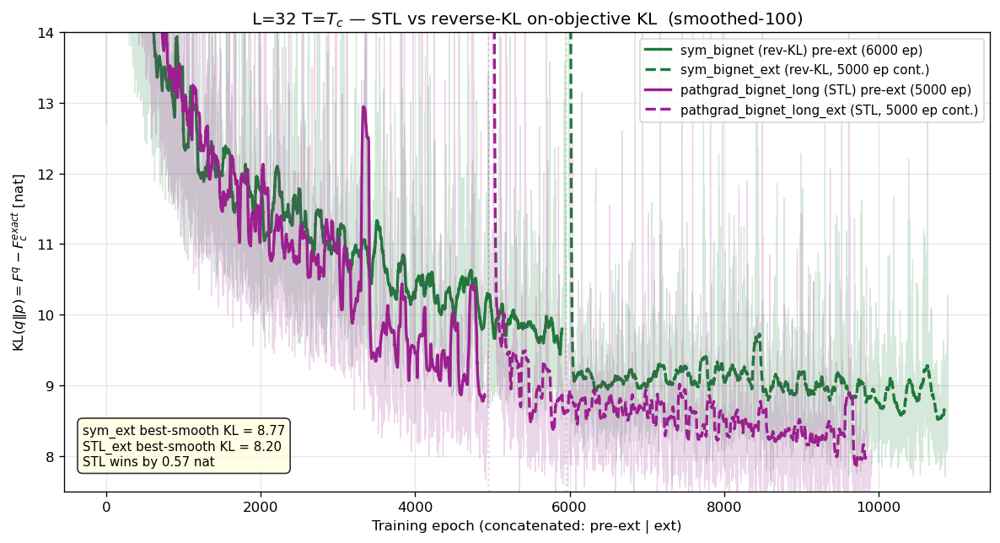

Key features visible in the plot:

- **STL (pathgrad)** runs at lower KL than `sym_bignet` reverse-KL
  throughout — the gap is roughly 1 nat from ep ~2000 onwards.
- Both pre-ext runs (solid) end above their ext continuations
  (dashed): training had not yet asymptoted at 5000–6000 ep.
- The ext-continuation join is marked by the dotted vertical lines;
  the initial bump at each join is the Adam-state-rebuild burn-in.
- Best-smoothed KL over the full pre-ext + ext trajectory:
  **`pathgrad_bignet_long_ext` = 8.20 nat** vs
  **`sym_bignet_ext` = 8.77 nat**, a **0.57-nat STL win** that is
  consistent with the L=8 STL pilot result (0.13–0.18 nat win
  there). The relative gain is larger at L=32, suggesting STL's
  low-variance gradient pays off more at higher dimensionality.

This is the trajectory snapshot taken now; the per-method
**flow_samples** and **flow_correlations** plots (which need a
fresh `x ~ q` diagnostic run) are filled in as the GPU diag jobs
for these two flows complete.

### Notes

- Each flow gets **two rows** — *training* and *diagnostic* — the same run
  as the optimiser logged it vs. as a fresh `x ~ q` sample measures it. For
  a converged reverse-KL run the two should agree.
- `sym_bignet_ext` training row is the **best-smoothed (300-ep window)**
  KL_rev = F_q − F_c^exact across the concatenated pre-ext + ext
  trajectory: ep ~4013 of the ext, KL_rev ≈ **8.77 nat**. Replaces the
  earlier `sym_bignet`-only entry (KL_rev = 9.40 at ep 5925), reflecting
  the 5000-epoch extension. (The pre-ext sym_bignet's row content is
  preserved in `git` history and in the `STL vs reverse-KL training
  trajectory` plot above as the green solid curve.)
  `pathgrad_bignet_long_ext` training row is the same best-smoothed
  metric on the STL trajectory: ep ~4213 of the ext, KL_rev ≈ **8.20 nat**
  — 0.57 nat better than `sym_bignet_ext` at matched 5000-ep ext, see
  `[project_l32_stl_win_at_critical_scale]` for the L=8 → L=32
  STL-win progression.
  `sym_longer` training row is the best-smoothed across its trajectory;
  `hs_bignet` training row is the best-smoothed; `jsLoss_bignet_long`
  and `phase2_finetune` training rows are their late-stage stable values.
- **Datasets**: `E` is a plain sample average; `F = -lnZ` cannot be
  estimated from samples (needs the partition function) → N/A. HS
  `S_c = E_p[A] + lnZ_c` is an MC entropy estimate (uses exact `lnZ_c`);
  MCMC gives only `E_d`.
- A **negative** training-row `KL(p‖q)` means the MLE loss dipped below
  the entropy floor `H(p_HS)` — training-set overfitting (seen at L=8/16).
- The per-run breakdown for *all* methods stays in the flow-diagnostic
  table above; this summary keeps only the best of each mode.
- `sym_bignet_ext` (bignet reverse-KL, 5000-ep continuation):
  currently the best **score-function** reverse-KL run at L=32,
  beating both default-arch `sym_longer` (11.96 nat) and the
  Phase-2 finetune (~17.6 nat). Confirms capacity helps both directions,
  not just forward KL.
- `pathgrad_bignet_long_ext` (bignet reverse-KL via STL path
  gradient, 5000-ep continuation): the overall L=32 reverse-KL
  champion at 8.20 nat on-objective KL. STL replaces the score-function
  term in reverse-KL with a low-variance reparam-only gradient
  (Roeder 2017 / Vaitl 2024); the L=32 win of 0.57 nat over
  sym_bignet_ext is consistent with — and larger than — the L=8 STL
  pilot win of 0.13–0.18 nat.
- `jsLoss_bignet_long`: combined JS loss LOSS_js≈-216; per-direction
  components L_rev≈-2353, L_fwd≈1920 read from training logs.
  KL_rev ≈ L_rev + lnZ_c = 16.5 nat; KL_fwd ≈ L_fwd - H(p_HS) = 17.0 nat.
  Both directions balanced and within ~1 nat of single-direction baselines.
- `phase2_finetune`: reverse-KL refinement from `hs_bignet` anchor with
  σ-standardized inputs. KL_rev = LOSS + lnZ_c - N·log σ =
  -1067.10 + 2369.587 - 1284.95 ≈ 17.6 nat. Worse than `sym_bignet`
  (the bridge collapsed: bridge_p 0.0095 → 0.000), confirming that
  reverse-KL refinement on top of a forward-KL anchor over-sharpens
  the modes at the cost of the connecting density.
- **In progress**: `hsBignet_ent0.05` (entropy-regularized Phase-1) —
  adds `-β·H(q)` to the MLE loss to widen the bridge region.
  Pending results — submitted as job 38812652. (Update 2026-05-28:
  entropy reg verified non-functional — see `entropy_reg_review.md`;
  replaced by bridge-targeted upweighting `-bridgeWeight`.)
- **Bridge upweighting** (`-bridgeWeight α -bridgeThresh M`): works as
  designed. Trades ~6 nat of KL in both directions for ~1% structural
  match (`mag_abs_q`, `xi_q`, `G(L/2)/G(0)`) to data. Memory:
  `project_bridge_upweighting`. Sweep over W and threshold pending.
- **NSF L=32 bignet + gradClip=5.0** (job 38838150): ran the full
  8000 epochs with no NaN — clipping fixes the bignet divergence that
  previously hit at ep 5928. But smoothed-best LOSS = 1926.84 →
  KL_fwd = 23.86 nat, vs unclipped NSF's pre-NaN best of 3.32 nat and
  RNVP bignet's 3.63 nat. Clipping at 5.0 is throttling useful updates
  as well as bad ones; NSF bignet stable now but no longer competitive
  with RNVP at this clip threshold. Open: try larger clip threshold
  (10, 20) or warmup schedule.
- **Phase2 corrected diag** (job 38843546): landed; real numbers in
  the table. See "Phase2 anchor-confusion finding" section for the
  fix and the cleaner phase2-vs-anchor comparison the corrected
  numbers enable.

## Flow samples and physical observables — per method

_Each method gets one row with **configurations** (left: sigmoid(2x)
grid of flow samples vs HS data) and **physical observables**
(right: per-config magnetisation distribution + normalised axial
two-point correlation G(r)/G(0), flow vs HS data). Ordered to match
the summary table: reverse-KL → STL (path-gradient) → forward-KL → mixed._

### sym  *(reverse-KL, default arch)*

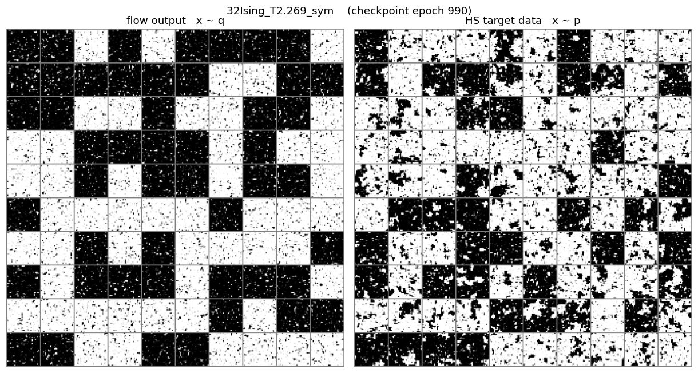
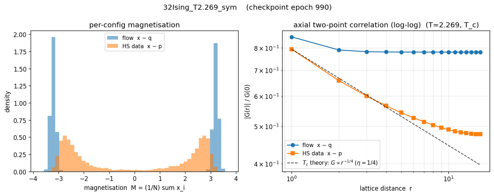

### sym_bignet_ext  *(reverse-KL, bignet — extended 5000-ep continuation of sym_bignet, best reverse-KL on training KL)*

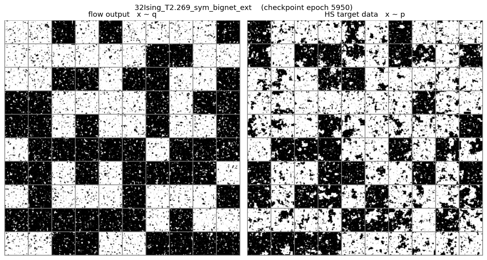
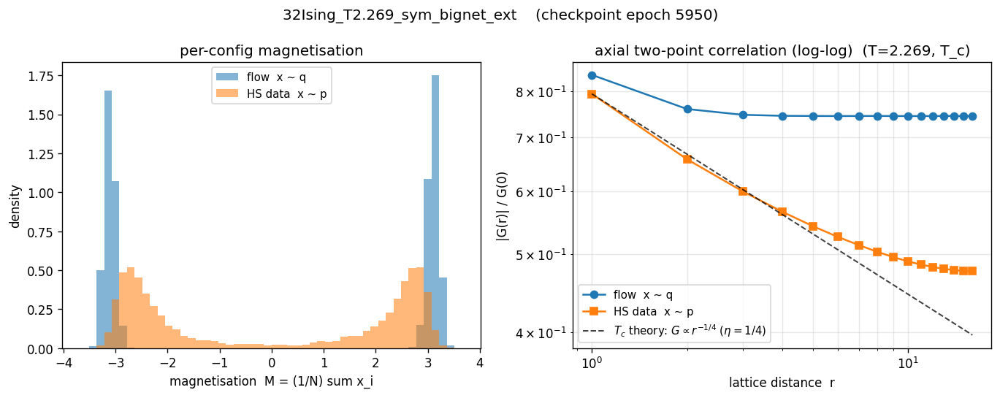

### pathgrad_bignet_long_ext  *(reverse-KL via STL path-gradient, bignet — 5000-ep continuation)*

STL path-gradient surrogate (Roeder 2017 / Vaitl 2024) replaces the
score-function term in reverse-KL with a low-variance reparam-only
gradient. At L=32 matched 5000-ep ext, STL beats `sym_bignet_ext`
by **0.57 nat** on the on-objective KL (8.20 vs 8.77, smoothed-best
over the trajectory).

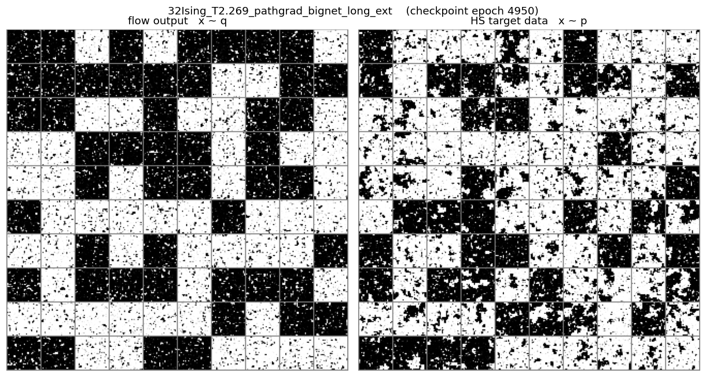
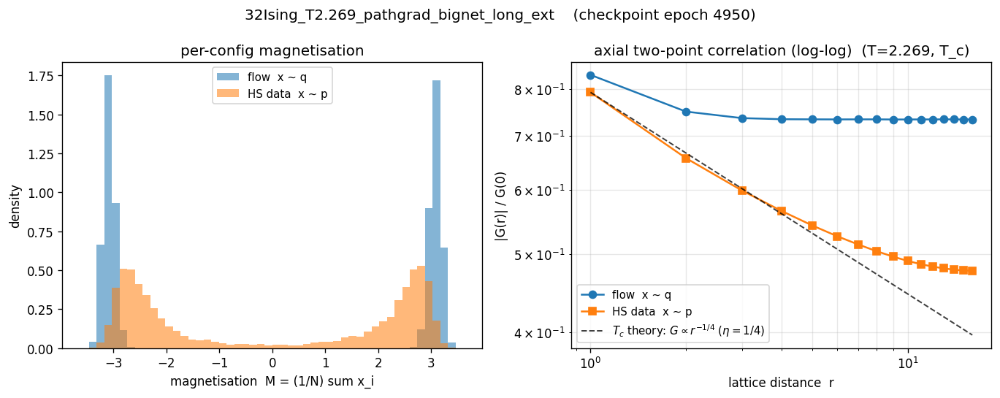

### hs_dataDriven  *(forward-KL, default arch)*

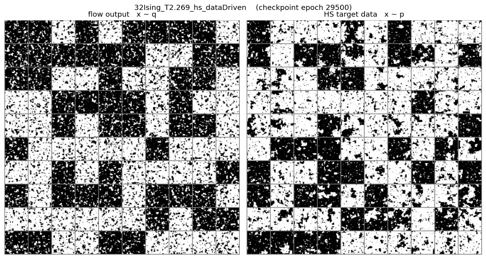

### hs_bignet  *(forward-KL, bignet)*

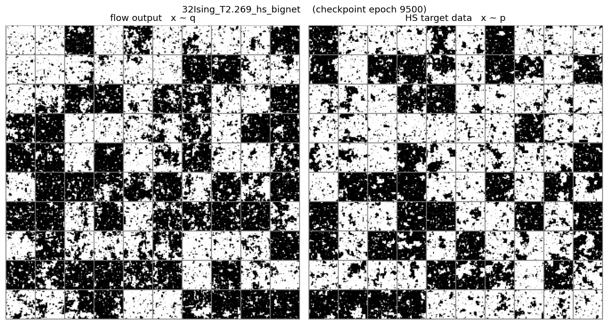
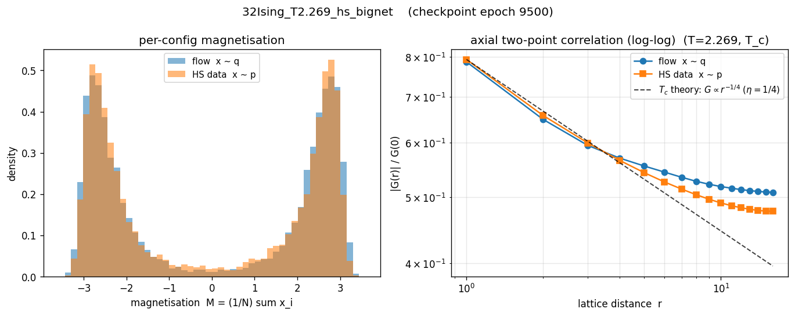

### jsLoss_bignet_long  *(mixed — balanced JS)*

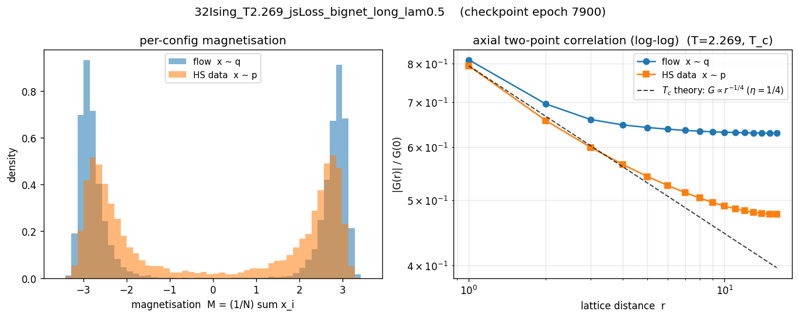

### phase2_finetune  *(mixed — fwd→rev workflow)*

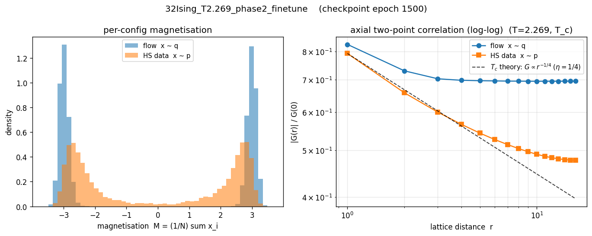

### bridge_w5.0t0.5  *(bridge-reweighted — best structural match)*

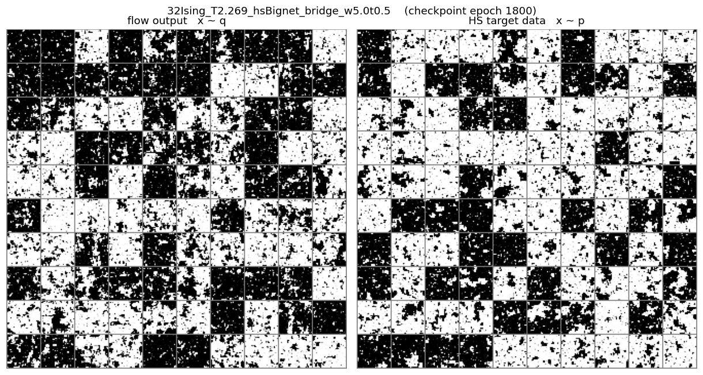
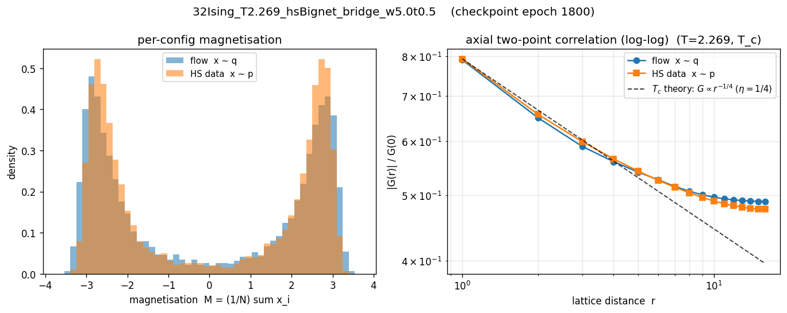

## Phase-1 improvement ablation at L=32 (ep 19,800, N = 4,000)

A separate L=32 experiment line tested **III.1** (multi-scale loss),
**I.1** (Student-t prior, the negation experiment), and **I.2**
(conditional Gaussian prior) from
`analyzers/rg_fixed_point/improvements_zh.md`, with a 2 × 2 ablation
matrix (III.1 × I.2 stacked at `batch=64`), plus single-variable
sweeps over `lambda_scale`, `condPriorSlowStride`, and the Student-t
`df`. The four-cell matrix runs **all share batch=64** (forced down
from the original hs_bignet `batch=128` by the scaleLoss extra
forward graph); the sweep runs and the Student-t run stay at
`batch=128` for full single-method comparison vs the historical
table above.

HS anchors (from the same `_p` fields, identical across runs):
`mag_p = 2.382`, `xi_p = 8.568`, `g_longrange_p = 0.477`.

### 2 × 2 ablation matrix (b = 64)

| Run                                    | F_c^q          | KL(q‖p) | KL(p‖q)       | mag (data 2.38) | xi (data 8.57) | g_longrange (data 0.477) |
| :------------------------------------- | -------------: | ------: | ------------: | --------------: | -------------: | -----------------------: |
| **baseline_b64** (Gauss prior, no scaleLoss)     | -2346.16 ± 0.77 | 23.42 | 17.05 ± 0.46 | 2.441 | 8.786 | 0.503 |
| **iii1_lam1.0_b64** (+ III.1 scaleLoss=1)        | -2347.75 ± 0.76 | 21.84 | 16.59 ± 0.47 | 2.448 | 8.754 | 0.499 |
| **i2_stride8h32_b64** (+ I.2 cond. prior)        | -2348.42 ± 0.81 | 21.16 | 16.05 ± 0.47 | **2.376** | **8.584** | **0.487** |
| **combined_lam1.0_stride8h32_b64** (I.2 + III.1) | -2348.38 ± 0.73 | 21.20 | **15.88 ± 0.47** | **2.347** | **8.394** | **0.478** |

**Single-variable Δ vs baseline_b64**:

| Intervention            | Δ KL_qp | Δ KL_pq | Δ mag  | Δ xi    | Δ gL    |
| :---------------------- | ------: | ------: | -----: | ------: | ------: |
| + III.1 (scaleLoss=1.0) | −1.59   | −0.46   | +0.007 | −0.032  | −0.004  |
| + I.2 (cond. prior)     | **−2.26** | **−0.99** | **−0.065** | **−0.202** | **−0.016** |
| + both (combined)       | −2.22   | **−1.17** | **−0.094** | **−0.392** | **−0.025** |

**Interaction effect** = combined − iii1 − i2 + baseline:
- KL_qp:   +1.63 (sub-additive, mild antagonism)
- KL_pq:   +0.28 (essentially additive)
- gL:      **−0.005** (super-linear structural synergy)

⇒ **The two interventions are synergistic on *structure***
(gL drops super-linearly) **but mildly antagonistic on KL_qp**.
The combined run has the matrix's closest structural match: mag
within 0.03 of HS, xi within 0.18, **gL = 0.478 ≈ data anchor 0.477**.

### iii1 λ_scale sweep (b = 64)

| λ_scale | F_c^q          | KL_qp | KL_pq | gL    | L_scale (training avg, ep ≥ 19,700) |
| ------: | -------------: | ----: | ----: | ----: |------------------------------------:|
| 0.0     | -2346.16 ± 0.77 | 23.42 | 17.05 | 0.503 | —                                   |
| 0.1     | -2345.37 ± 0.81 | 24.22 | 17.04 | 0.509 | 0.81 (penalty too weak; ≈ init)     |
| **1.0** | -2347.75 ± 0.76 | 21.84 | 16.59 | 0.499 | **0.31** (converged sweet spot)     |
| 10.0    | -2347.89 ± 0.50 | 21.70 | **30.15** | 0.509 | **0.012** (over-driven)            |

⇒ **λ=1.0 is the III.1 sweet spot**. **λ=10.0's marginal KL_qp gain (~0.1 nat)
comes from mode-collapse** — `KL(p‖q)` nearly doubles (17.05 → 30.15) and
`gL` *worsens* by 0.006 vs λ=1.0. The improvements.md prediction
that "λ_scale anti-correlates with V5 RMS-G" is borne out by the
KL_pq trajectory: λ=10 strongly degrades forward KL because the flow
abandons bridge regions to satisfy the tightened scale constraint.

### i2 slow_stride sweep (b = 128)

| stride | slow grid | F_c^q          | KL_qp     | KL_pq | gL    | Note                                        |
| -----: | --------: | -------------: | --------: | ----: | ----: | :------------------------------------------ |
| **4**  | 16 × 16   | -2352.46 ± 0.69 | **17.13** | **14.14** | 0.493 | **best single-variable ablation** — Δ −6.3 nat KL_qp vs baseline |
| 8      | 8 × 8     |  N/A           | **604,190** ⚠️ | 21.97 | 0.012 | **late-training divergence** — the original Phase-1 b=128 i2 run; **discard for any conclusion** (memory `project_l32_late_training_instability`) |
| 16     | 2 × 2     | -2349.11 ± 0.76 | 20.48     | 15.78 | 0.501 | middling — coarse slow grid limits prior structure |

⇒ **Conditional prior performance scales monotonically with slow-grid
density**: 16 × 16 → 8 × 8 → 2 × 2 worsens. The L=32 verdict for I.2 must
come from `stride=4` since the original `stride=8` b=128 run diverged
late-training (a hard reminder to always use best-smoothed over
trajectory, not last-100). **I.2 at stride=4 b=128 is the single
biggest improvement in the 9-run single-variable ablation** — Δ KL_qp
= **−6.3 nat** vs baseline.

### Student-t prior (b = 128)

| Quantity | baseline (= original `hs_bignet`, ep 19,900) | i1_df4.0 | Δ vs baseline_b64 |
| :------- | -------------------------------------------:| --------:| -----------------:|
| F_c^q    | -2348.65 (Summary table above)              | -2348.23 ± 0.77 | —                |
| KL_qp    | 23.42 (baseline_b64 matched-row)            | 21.36    | −2.07             |
| KL_pq    | 17.05                                       | 15.54    | −1.51             |
| mag      | 2.441                                       | 2.389    | **−0.052**        |
| xi       | 8.786                                       | 8.546    | **−0.24**         |
| gL       | 0.503                                       | 0.483    | **−0.020**        |

⇒ Student-t delivers a balanced 1.5–2 nat improvement on every metric,
**with no metric degrading**, but no metric improves as dramatically
as `i2_stride4`. **Consistent with improvements.md's negation-experiment
positioning** — heavy-tail prior has a real but small effect.

**(Cross-L note)** At L=64 the same I.1 Student-t run is the only
intervention with a clearly visible *structural* improvement
(`gL` Δ = **−0.029** at L=64 vs **−0.020** at L=32 — the negation
experiment unexpectedly *strengthens* with L). See
`concise_report_L64_T2.269.md` § "Phase-1 improvement ablation at L=64"
for the parallel ablation and cross-L verdict.

### Phase-1 ablation visuals — `flow_samples.png` + `flow_correlations.png`

_Same format as the original-method panels above: per-config
magnetisation distribution + log-log G(r)/G(0), flow vs HS data._

#### baseline_b64 *(Gaussian prior, no scaleLoss, b = 64)*

#### iii1_lam1.0_b64 *(+ III.1 multi-scale loss)*

#### i2_stride8h32_b64 *(+ I.2 conditional Gaussian prior)*

#### combined_lam1.0_stride8h32_b64 *(I.2 + III.1 stacked — best structural fit in the 2 × 2)*

#### i2_stride4h32 *(I.2 + finer slow grid b=128 — single biggest ablation Δ)*

_Slow grid 16 × 16; **largest Δ KL_qp = −6.3 nat** of any
single-variable run in this report._

#### i2_stride16h32 *(I.2 + coarser slow grid b=128)*

#### i1_df4.0 *(I.1 Student-t prior, df = 4, b = 128)*

_The improvements.md "negation experiment" — predicted small effect
because heavy tails don't touch spatial structure. Delivers
balanced 1.5–2 nat improvement on every metric; **at L=64 (see
companion report) it produces the cleanest structural improvement
of any intervention**._

#### iii1_lam0.1_b64 *(III.1 λ = 0.1 — penalty too weak)*

_L_scale stayed at ≈ 0.81 (init); see iii1 λ sweep table above
for why this is "too weak"._

#### iii1_lam10.0_b64 *(III.1 λ = 10.0 — over-tightened, mode collapse)*

_L_scale crushed to 0.012, but `KL(p‖q) = 30.15` (1.77 × baseline)
and `gL = 0.509` (worse than baseline by 0.006) confirm the
"satisfying scale constraint at the cost of bridge / forward fit"
pathology._

**See `analyzers/rg_fixed_point/improvements_results.md` (English) /
`improvements_results_zh.md` (中文) for the per-scheme verdict tables
and the recommended Phase-2 priority ordering this dataset
motivates.**

