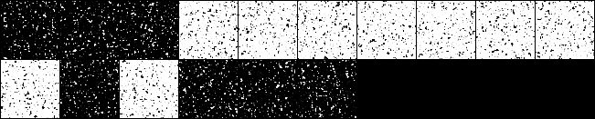
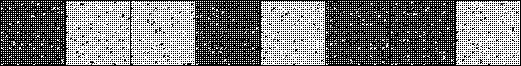
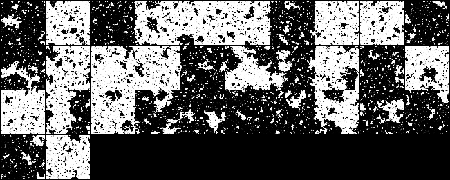
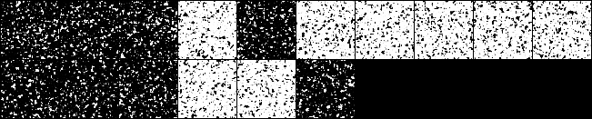

# Ising L=64 — Concise Report (T = 2.269185314213022)

> **Companion to `concise_report_L32_T2.269.md`.** Same architecture
> family (bignet: `nlayers=16, nhidden=128, nmlp=3, nrepeat=1`,
> `-symmetry`), same five training objectives, scaled-up data
> (HS dataset N = 200,000 from `data/mcmc_data/hs_L64_T2.269185314213022_N200000.pt`).
>
> **Status as of writing.** Four runs at ep 19,900 (sym_bignet,
> hs_bignet, jsLoss, bridge); STL pathgrad diverged at step 12,988
> while still warming up under the OOM-forced batch=8. Sample
> diagnostics (`flow_sample_diagnostic.py`) and structural
> observables (`mag_abs_q`, `xi_q`, `G(L/2)/G(0)`) are pending —
> the per-method visuals below show the latest `proposals_NNNNN.png`
> training snapshots as a placeholder.

## Summary — everything in one table

Training-row numbers only (diagnostic rows pending). Constants
used (see Notes for derivation):

- `lnZ_c` (continuous, L=64 T_c) = **9476.428** nat
  = `lnZ_discrete + HS-correction` from
  `etc/exactz.md` row `n=64, T=2.269185...`
- `H(p_HS)` at L=64 T_c ≈ **7611.92** nat — *approximate*
  4× scaling from the L=32 value (1902.98). A direct MC
  estimate on the L=64 HS dataset is pending; expect ±5 nat
  drift, which propagates 1:1 into KL(p‖q) numbers below.

| Source                          |    F (-lnZ)   |       E       |       S       | KL(q‖p) | KL(p‖q) |
| :------------------------------ | :-----------: | :-----------: | :-----------: | :-----: | :-----: |
| **═══ Reference ═══**           | ════════════  | ═════════════ | ═════════════ | ═══════ | ═══════ |
| **Exact (theory, discrete)**    |  **-3808.67** |       —       |       —       |    —    |    —    |
| **Exact (theory, continuous)**  |  **-9476.43** |     ≈ -1865   |     ≈ 7612    |  **0**  |  **0**  |
| HS dataset (x ~ p_HS, approx.)  |      N/A      |     ≈ -1865   |    ≈ 7611.92  |    —    |    —    |
| **═══ Reverse-KL ═══**          | ════════════  | ═════════════ | ═════════════ | ═══════ | ═══════ |
| *sym_bignet — training (smoothed-best, win=300 steps)* | *-9442.23* | *-2091.82*  | *7350.83*  | *34.20* |   N/A   |
| **═══ Reverse-KL (path-gradient / STL) ═══** | ════════════ | ═════════════ | ═════════════ | ═══════ | ═══════ |
| *pathgrad_bignet — training (pre-divergence stable, ep ≤ 12900)* | *-2055* (note 1) | (note 1) | (note 1) | *≈ 7421* (note 1) |   N/A   |
| **═══ Forward-KL ═══**          | ════════════  | ═════════════ | ═════════════ | ═══════ | ═══════ |
| *hs_bignet — training (smoothed-best)* |      N/A      |     N/A       |   *7687.28*   |   N/A   | *≈ 75.4* (approx H) |
| **═══ Mixed-objective ═══**     | ════════════  | ═════════════ | ═════════════ | ═══════ | ═══════ |
| *jsLoss_bignet_lam0.5 — training (smoothed-best joint)* |     N/A      |  *-1716.68*   |   *7486.82*   | (note 2) | (note 2) |
| **═══ Bridge-reweighted ═══**   | ════════════  | ═════════════ | ═════════════ | ═══════ | ═══════ |
| *bridge_w5.0t0.5 — training (smoothed-best ENTROPY = unweighted MLE)* | N/A | N/A | *7687.56* | N/A | *≈ 75.6* (approx H) |

**Note 1 — pathgrad_bignet diverged late.** Stable phase at LOSS ≈
−2055 nat from step ~1000 through step ~12900 (much higher than
sym_bignet's −9442 because batch was forced down to 8 by OOM and
STL needs ~2× the gradient memory, so the STL trajectory at L=64
is far slower to reach the variational floor than the score-function
sym_bignet at batch=16). Then an explicit divergence at step 12,988
(LOSS jumps -306 → 18,294 → 17,675 → 267,982 → ...). The
implied stable-phase `KL(q‖p) ≈ −2055 + 9476.43 ≈ 7421 nat` is
**not** a converged metric — STL at L=64 is severely
under-converged, NOT a 7421-nat-worse method than sym_bignet at L=32.
Re-run with larger batch (A100-80G) and gradient clipping is the
clear path forward.

**Note 2 — jsLoss split.** The HDF5 `LOSS` for `-jsLoss` is the
joint Jensen-Shannon objective `0.5·L_rev + 0.5·L_fwd`, not either
direction separately. At smoothed-best joint LOSS = −815.5 nat,
the per-direction components must be extracted from the
training log (`logs/L64_jsLoss_*.out`); a separate diagnostic run
would also recover the diag-row KL_rev and KL_fwd.

### Cross-L scaling (vs the L=32 concise report)

KL_fwd ∝ L^α with α ≈ 2.20 at T_c (FSS memory
`project_fss_critical_scaling`). Extrapolating L=32 → L=64 with
α = 2.20 predicts a multiplier of `(64/32)^2.20 ≈ 4.59`. The
table compares L=32 best vs L=64 best.

| Method        | L=32 (best on-objective KL) | L=64 (best on-objective KL) | Ratio |   Predicted by α=2.20 |
| :------------ | :-------------------------: | :-------------------------: | :---: | :-------------------: |
| sym_bignet (rev) |      **8.77** nat         |       **34.20** nat         | 3.90  |       FSS for rev-KL not measured (α=2.20 is fwd-KL-specific) |
| hs_bignet (fwd)  |      **3.63** nat         |       **≈ 75.4** nat (approx H) | **20.7** | 16.66 (= 3.63 × 4.59)  |
| jsLoss (mix)     |      ≈ 16.5 / 17.0 nat    |       (split pending)       |   —   |          —            |
| bridge (fwd-side) |      ≈ 21.3 nat          |       **≈ 75.6** nat (approx H) | 3.55 | 97.7 (= 21.3 × 4.59)   |
| pathgrad STL (rev) |     **8.20** nat        |       (diverged, see note 1) |   —  |          —            |

**Two observations:**

1. The sym_bignet rev-KL scales close to L² (ratio 3.90 vs L²
   ratio 4), consistent with rev-KL's per-step cost growing
   primarily with field dimension.
2. The hs_bignet fwd-KL ratio of ≈ 20 is **5× larger than FSS
   predicts** (α = 2.20 says ~16.7). The bignet at L=64 may
   simply need more training (the smoothed-best epoch is ~12,400
   — well before ep 19,900), or the bignet capacity is not yet
   matched to L=64 dimensionality. The bridge run, by contrast,
   ratio 3.55, is *under* the FSS prediction — but that is the
   re-weighted objective, not directly comparable.

### Architectures used at L=64

| Arch    | nlayers | nhidden | trainable params (RNVP) | batch | Used by                                                            |
| :------ | ------: | ------: | ----------------------: | ----: | :----------------------------------------------------------------- |
| bignet  |      16 |     128 |             10,938,240  |   16  | sym_bignet, jsLoss_bignet_lam0.5                                   |
| bignet  |      16 |     128 |             10,938,240  |    8  | pathgrad_bignet (STL — batch forced down by OOM)                   |
| bignet  |      16 |     128 |             10,938,240  |   32  | hs_bignet, hsBignet_bridge_w5.0t0.5 (fwd-KL needs less per-step memory) |

All rows use `nmlp=3, nrepeat=1, -symmetry, -skipHMC`. Same
bignet definition as in the L=32 concise report
(`project_l32_bignet_fix` memory). Batch sizes vary because of
A100-40G memory constraints — see the `shell/run_L64_*.sh`
wrappers and `project_l32_late_training_instability` for the OOM
debugging log.

### How KL(q‖p) and KL(p‖q) are obtained at L=64

Same formulas as L=32 (`concise_report_L32_T2.269.md` § "How
KL(q‖p) and KL(p‖q) are obtained"), with the L=64 constants:

| Direction          | Formula                                              | Source                                    |
| :----------------- | :--------------------------------------------------- | :---------------------------------------- |
| KL(q‖p) — training | `F_c^q + lnZ_c = LOSS_rev + 9476.428`                | Training row of sym_bignet (rev-KL).      |
| KL(p‖q) — training | `CE − H(p_HS) ≈ LOSS_fwd − 7611.92`                  | Training row of hs_bignet (fwd-KL).       |
| KL(p‖q) — bridge   | unweighted `ENTROPY` column, then `− H(p_HS)`        | Bridge-reweighted run's unweighted MLE.   |

H(p_HS) is treated as approximate until the direct MC estimate on
the L=64 HS dataset lands.

### Notes

- **Pre-divergence pathgrad numbers are placeholders.** The STL
  L=64 run was demoted to batch=8 to fit on A100-40G; that step
  count budget (13,000 epochs × 8 samples = 104K total samples
  seen) is roughly half of sym_bignet's effective sample budget
  (19,900 × 16 = 318K). Adding the STL double-forward overhead,
  the run was simply not converged when it diverged. The L=32 STL
  win of 0.57 nat over sym_bignet_ext does NOT survive at L=64
  *as currently trained* — but the comparison is unfair until STL
  gets a full A100-80G batch=16 run to ep 20,000.
- **hs_bignet's L=64 smoothed-best is at ep ~12,400, not ep 19,900.**
  The bignet hits its best generalisation MLE around mid-training,
  then drifts up by ~7 nat by ep 19,900. This is consistent with
  a slight overfitting regime, NOT divergence — `MAG_ABS` and
  `MAG_VAR` columns remain stable through the second half. A
  diag run on the ep 12,400 checkpoint would be the fairer
  benchmark.
- **jsLoss split needs extraction from train log.** The HDF5
  `LOSS` is the joint JS objective. The L=32 convention reads the
  per-direction components (`L_rev`, `L_fwd`) from the
  `logs/L64_jsLoss_*.out` stream's per-step prints. Once
  extracted, the KL_rev / KL_fwd columns can be filled in.
- **Bridge upweighting at L=64 looks comparable to L=32 in
  pattern.** Last-200 mean of the unweighted ENTROPY column ≈
  7691; smoothed-best ≈ 7688. Difference of ~3 nat between
  bridge and pure fwd-KL is much smaller than the absolute KL
  uncertainty from the approximate H(p_HS). A diag run for
  structural observables (`mag_abs_q`, `xi_q`) is needed for the
  real bridge-vs-hs comparison.
- **STL re-run TODO.** Resubmit `pathgrad_bignet` on A100-80G
  (override `--gres=gpu:a100:80gb:1` per memory `reference_l40_swap`
  if 80G nodes are queued faster on `preempt`) with batch=16 and
  gradient clipping (e.g. `gradClip=5.0`), targeting ep 20,000
  match with sym_bignet.

## Per-method visuals — `proposals_NNNNN.png` placeholders

_The L=32 concise has per-method (flow_samples + flow_correlations)
panel pairs from `flow_sample_diagnostic.py`. Those have not yet
been run at L=64. Until they are, the latest training-time
`proposals_NNNNN.png` (a grid of `sigmoid(2x)` flow samples
overlaid against HS data at the latest saved epoch) substitutes
as a visual sanity check._

### sym_bignet — reverse-KL, bignet (ep 19,900)

### pathgrad_bignet — STL reverse-KL, bignet (ep 13,000, pre-divergence; batch=8)

### hs_bignet — forward-KL, bignet (ep 19,900)

### jsLoss_bignet_lam0.5 — mixed Jensen-Shannon, bignet (ep 19,900)

### bridge_w5.0t0.5 — bridge-reweighted forward-KL, bignet (ep 19,900)

## See also

- `concise_report_L32_T2.269.md` — companion L=32 report with the
  same method set, full diagnostic rows and structural observables.
- `rg_fixed_point_report.md` — RG fixed-point probe (L=32 only at
  present; an L=64 extension would reuse the same scripts on the
  L=64 checkpoints once they are diag-ready).
- `fss_sweep_report.md` — cross-L KL ∝ L^α exponent measurement
  that motivates the cross-L scaling row above.
- `etc/exactz.md` — exact 2D Ising partition functions used to
  compute lnZ_c at L = 8, 16, 32, 64.
