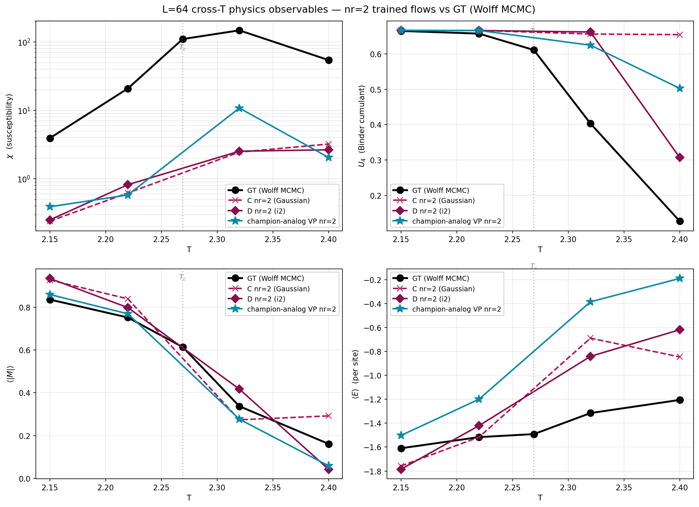

# Ising L=64 — Cross-T behavior of nr=2 flows (2026-07-16)

Do the L=64 nr=2 architectures reproduce phase-transition physics when
trained SEPARATELY at each T ∈ {2.15, 2.22, 2.32, 2.4}? Each cell is a
distinct training run on the corresponding HS-transformed MCMC dataset
(~9 500 epochs — smaller than the T_c cells' 15-30 k budget). Job 41815352
(2026-07-16) sampled each and Tier-1'd against Wolff GT.

Cross-T behavior at T=T_c=2.269 comes from the standard concise report
`concise_report_L64_T2.269.md` (nr=2 continuation numbers at ep 4500,
Best-200 anchored).

## Models across T

- **C nr=2** = `baseline_nr2` (Gaussian nr=2, no CNN prior)
- **D nr=2** = `i2_stride8h32_nr2` (Phase-2 winner, conditional_gaussian, single CNN)
- **champion-analog VP nr=2** = `hcg_perscale_fixdil_vp1e-3_nr2` (fixdil per-scale HCG + VP)

Nr=1 champion + nr=1 baseline are not in this analysis — no cross-T
training data exists at nr=1 for L=64.

## Susceptibility χ across T

| T | Phase | GT | C nr=2 | D nr=2 | champion-analog VP nr=2 |
|:-:|-------|---:|---:|---:|---:|
| 2.15 | ordered | 3.92 | 0.24 | 0.25 | 0.39 |
| 2.22 | slightly below T_c | 20.86 | 0.62 | 0.82 | 0.58 |
| 2.269 (T_c) | critical | **110.15** | 72.3 | 20.0 | 27.0 |
| 2.32 | slightly above T_c | **147.69** | 2.45 | 2.53 | **10.80** |
| 2.4 | disordered | 54.35 | 3.22 | 2.65 | 2.05 |

**All three flows under-predict χ by 5-100× at every off-T_c point.**
The champion-analog VP nr=2 is best-at-T=2.32 (10.8, 4× closer to GT
than C or D) but still 14× under GT. The physics deficit *worsens* away
from T_c — off-critical flows have essentially frozen samples.

## Binder cumulant U₄ across T

| T | GT | C nr=2 | D nr=2 | champion-analog VP nr=2 |
|:-:|:-:|:-:|:-:|:-:|
| 2.15 | 0.665 | 0.667 | 0.667 | 0.666 |
| 2.22 | 0.657 | 0.666 | 0.666 | 0.666 |
| 2.32 | **0.403** | 0.656 | 0.662 | 0.625 |
| 2.4  | **0.127** | 0.654 | 0.307 | 0.503 |

**GT's U₄ drops sharply from ~0.66 (ordered) through 0.61 (critical) to
0.13 (disordered)** — the classic phase-transition signature. Models:

- **C nr=2 is stuck at U₄ ≈ 0.65 everywhere** — has not learned the
  transition; samples the same "critical-like" distribution at every T.
  Plain Gaussian prior + nr=2 depth doesn't discriminate phases.
- **D nr=2** partially responds (U₄ = 0.31 at T=2.4).
- **Champion-analog VP nr=2** partial response too (U₄ = 0.50 at T=2.4);
  slightly further from GT than D.

## ⟨\|M\|⟩ and ⟨E⟩ across T

| T | GT ⟨\|M\|⟩ | C | D | champ-VP |    | GT ⟨E⟩ | C | D | champ-VP |
|:-:|:-:|:-:|:-:|:-:|:-:|:-:|:-:|:-:|:-:|
| 2.15 | 0.836 | 0.927 | 0.934 | 0.859 |   | −1.610 | −1.758 | −1.785 | −1.503 |
| 2.22 | 0.752 | 0.839 | 0.798 | 0.769 |   | −1.516 | −1.517 | −1.420 | −1.199 |
| 2.32 | 0.337 | 0.274 | 0.417 | 0.277 |   | −1.315 | −0.689 | −0.841 | −0.384 |
| 2.4  | 0.161 | 0.292 | 0.043 | 0.059 |   | −1.205 | −0.846 | −0.618 | −0.189 |

Order parameter tracks GT qualitatively (high in ordered, low in
disordered) but with 20-100% errors. Energy tracks less cleanly — above
T_c all models over-estimate E (too disordered / too much frustration)
by 30-90%.

## Figure

Four panels: χ (log-y), U₄, ⟨\|M\|⟩, ⟨E⟩ across T ∈ {2.15, 2.22, 2.269,
2.32, 2.4}. GT (black) vs three nr=2 models. T_c marked as dashed
vertical line.

## Reading

1. **Every trained flow has 5-100× χ deficit at off-T_c.** Since χ ∝
   Var(\|M\|), the samples don't have enough |M| variance at any T.
   Consistent with the mode-collapse story: even off-critical trained
   models collapse to narrow |M| distributions, losing the
   critical-fluctuation signature χ is supposed to capture.
2. **C nr=2 (Gaussian) hasn't learned the phase transition** — its
   U₄ ≈ 0.65 at every T means it always produces critical-like samples,
   regardless of what training T told it. Plain Gaussian prior + nr=2
   depth doesn't provide enough structure to discriminate phases.
3. **CNN priors (D, champion-analog) do respond to T** — U₄ moves in the
   right direction at T=2.4 (down from ~0.65 toward 0.13). But magnitude
   is still off — U₄ = 0.5 (champion-analog) vs GT 0.13.
4. **9 500 epochs is not enough at off-T_c.** Full T_c runs converged
   over 30 k+ epochs; the off-T_c runs stopped at 9 500 (walltime-cut at
   initial submission). More epochs would likely improve, especially in
   the ordered phase where the loss landscape is smoother.
5. **The champion advantage is T_c-specific.** At T_c the champion
   (nr=1) beat all others by 10-30 nat. The nr=2 analog doesn't inherit
   that advantage cross-T — it under-predicts χ by more than D at
   T=2.15/2.22 and by less at T=2.32, but nowhere is it a clear cross-T
   winner.

## Practical implication

The "champion recipe" (fixdil + VP-1e-3) is a T_c-specific optimization.
Cross-T deployment would need per-T retraining with adequate epoch
budget, or a multi-T conditional flow architecture (the current code
doesn't support this).

## Data provenance

- Cross-T training folders: `data/64Ising_T{T}_hsBignet_{tag}_b16` for
  T ∈ {2.15, 2.22, 2.32, 2.4} and tag ∈ {baseline_nr2,
  i2_stride8h32_nr2, hcg_perscale_fixdil_vp1e-3_nr2}. Each trained ~9500
  epochs, N=200 000 dataset.
- Diagnostic + Tier-1 runs: job 41815352 (GPU, 3h wall, ep=latest saving).
- GT reference: 4000 Wolff MCMC samples per T at L=64 (from
  `data/mcmc_data/hs_L64_T{T}_N*.pt`).
- Log with all `[TIER1_ROW]` lines: `logs/cross_T_diag_41815352.out`.
- Figure: `analyzers/rg_fixed_point/figures/L64_crossT_observables.png`.

## See also

- `concise_report_L64_T2.269.md` — T_c behavior of same models plus the
  nr=1 champion.
- `../rg_fixed_point/rg_fixed_point_report_on_top_models.md` — layer-level
  analysis of the champion + A + D + B at T_c.
