# Ising L=16 — Forward-KL Temperature Sweep

Five-point temperature sweep at L=16 in the HS continuous-field
forward-KL training mode. Each (T) run is independent — fresh init,
20000 epochs, default arch, `-symmetry -noDeq -dataDriven`,
batch=128, HS dataset N=200000 per T. Headline numbers from
`analyzers/fss_sweep_KL_v2.csv`; the cross-L per-site / power-law
analysis lives in `fss_sweep_report.md`.

## Architecture

| Arch    | nlayers | nhidden | trainable params |
| :------ | ------: | ------: | ---------------: |
| default |      10 |      64 |        1,424,320 |

The four off-T_c L=16 points were re-run with the default arch on
2026-05-28 (jobs 38838147/8/9), replacing earlier "midbig"
(nlayers=12, nhidden=96) runs that gave non-monotonic results
(default beats midbig at L=16 T_c by 1.6 nat). See `fss_sweep_report.md`
"L=16 off-critical points (resolved 2026-05-28)" for the swap. The
original `data/16Ising_T*_hs_dataDriven` folders retain the midbig
runs; the canonical default-arch runs live in
`data/16Ising_T*_hs_dataDriven_default/`.

## Summary table

Rows are grouped: **reference (per T) → forward-KL training (per T) →
forward-KL diagnostic (per T)** with `══════` dividers.

| T     | Source                                  |    F (−lnZ)    |      E      |       S       | KL(q‖p) | KL(p‖q)  |
| :---: | :-------------------------------------- | :------------: | :---------: | :-----------: | :-----: | :------: |
| **═══ Reference (HS continuous-field) ═══** | ════════════ | ═══════════ | ═════════════ | ═══════ | ═══════  |
| 2.150 | HS dataset (sample, N=200k)             |     N/A        |    N/A      |    467.961    |    —    |    —     |
| 2.220 | HS dataset                              |     N/A        |    N/A      |    471.274    |    —    |    —     |
| 2.269 | **Exact (theory, continuous)**          | **−592.876**   |    N/A      |    N/A        |  **0**  |  **0**   |
| 2.269 | HS dataset                              |     N/A        |    N/A      |    474.350    |    —    |    —     |
| 2.320 | HS dataset                              |     N/A        |    N/A      |    478.334    |    —    |    —     |
| 2.400 | **Exact (theory, continuous)**          | **−566.134**   |    N/A      |    N/A        |  **0**  |  **0**   |
| 2.400 | HS dataset                              |     N/A        |    N/A      |    483.473    |    —    |    —     |
| **═══ Forward-KL training (hs_dataDriven, default arch) ═══** | ════════════ | ═══════════ | ═════════════ | ═══════ | ═══════  |
| 2.150 | *hs_dataDriven_default — training (ep 13672)* |  N/A     |    N/A      |  *470.207*    |   N/A   | *2.247*  |
| 2.220 | *hs_dataDriven_default — training (ep 16018)* |  N/A     |    N/A      |  *474.864*    |   N/A   | *3.589*  |
| 2.269 | *hs_dataDriven — training (ep 22845)*  |     N/A        |    N/A      |  *477.508*    |   N/A   | *3.159*  |
| 2.320 | *hs_dataDriven_default — training (ep 8778)*  |  N/A     |    N/A      |  *481.339*    |   N/A   | *3.005*  |
| 2.400 | *hs_dataDriven_default — training (ep 18575)* |  N/A     |    N/A      |  *486.738*    |   N/A   | *3.265*  |
| **═══ Forward-KL diagnostic (post-hoc x ~ q) ═══** | ════════════ | ═══════════ | ═════════════ | ═══════ | ═══════  |
| 2.150 | hs_dataDriven_default — diag (ep 19500) |   −617.85    |   −145.6    |    472.21     |  (post) |  (post)  |
| 2.220 | hs_dataDriven_default — diag (ep 19500) |   −600.49    |   −122.6    |    477.88     |  (post) |  (post)  |
| 2.269 | hs_dataDriven — diag (ep 29500)        |    −587.90    |   −108.1    |    479.80     |  4.971  |   3.787  |
| 2.320 | hs_dataDriven_default — diag (ep 19500) |   −576.73    |    −85.9    |    490.87     |  (post) |  (post)  |
| 2.400 | hs_dataDriven_default — diag (ep 19500) |   −560.28    |    −69.4    |    490.93     |  5.856  |   3.695  |

`(post)` rows = pending re-diagnostic (job 39361308) for the HS-data-side
fields; existing JSONs at those (L, T) points were generated before the
HS dataset was linked into `flow_sample_diagnostic.py`.

## How to read

Same convention as L=8 / L=32 reports. Forward-KL trains only `S`
(MLE entropy); flow-side `F^q` and `E^q` are from the post-hoc
diagnostic. `KL(p‖q) training = LOSS − H(p_HS)`, on-objective;
`KL(q‖p) diag` is the off-objective sanity check.

## Structural diagnostics

| T     | mag_abs_q (flow) | mag_abs_p (data) | xi_q (flow) | xi_p (data) |
| :---: | ---------------: | ---------------: | ----------: | ----------: |
| 2.150 |   3.228          |  (post)          |   5.935     |  (post)     |
| 2.220 |   2.909          |  (post)          |   5.402     |  (post)     |
| 2.269 |  (post)          |  (post)          |  (post)     |  (post)     |
| 2.320 |   2.284          |  (post)          |   4.147     |  (post)     |
| 2.400 |   1.819          |   1.781          |   3.550     |   3.544     |

L=16 T_c flow-side mag_abs_q / xi_q values lost (the existing JSON
predates the structural-stats addition); the re-diagnostic populates
them. T=2.4 fully-populated row shows
`mag_abs_q ≈ mag_abs_p` to 2% and `xi_q ≈ xi_p` to 0.2% — well-fit
at the off-critical endpoint.

## Notes

- `fss_sweep_KL_v2.csv` keeps the L=16 off-critical default-arch
  re-runs (correct numbers); the pre-2026-05-28 fork that used
  midbig is gone.
- KL(p‖q) at L=16 ranges 2.25–3.59 across the sweep — about 5×
  larger than L=8 (0.58–0.79). Per-site basis 0.0088–0.0140 vs L=8's
  0.0090–0.0124. Off-critical, the per-site KL is very close;
  the critical excess is small in absolute (Δ ~0.001 nat/site) but
  reproducible.
- Diagnostic regeneration (job 39361308) refreshes every JSON +
  PNG in this report.

## HS dataset overview across temperature

The three panels below are computed directly from the HS dataset
samples (`data/mcmc_data/hs_L16_T*_N200000.pt`) — no flow involved.
They give the target the forward-KL run is trying to fit. Generated
by `analyzers/make_data_panels.py --L 16`.

### Configurations across T (one panel per T)

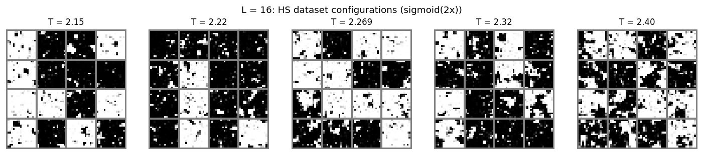

16 random HS samples per T, sigmoid(2x) rendering. At L=16 the
domain structure at low T is more visible than at L=8 — the patches
are larger relative to the lattice, and the bridging between ±
regions at T_c is clearer.

### P(M) overlay across T

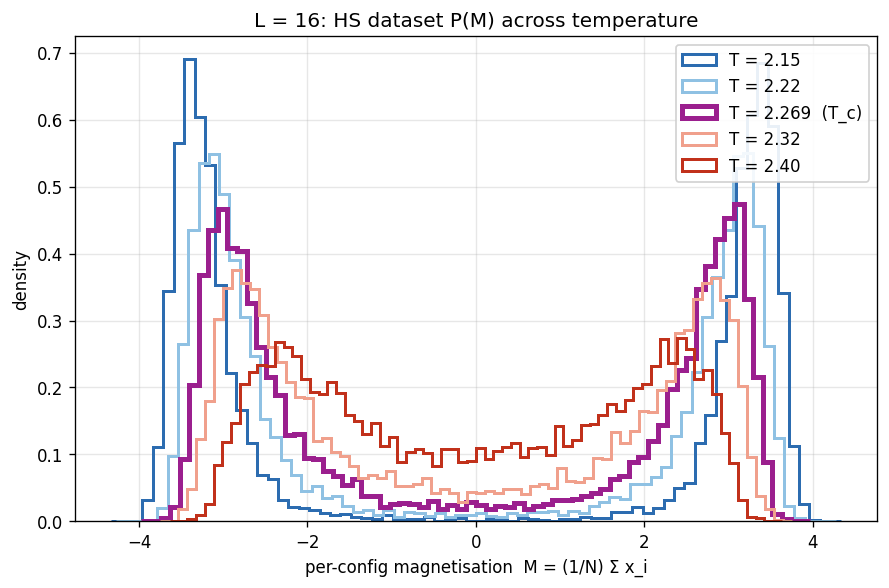

`P(M)` across T, all on one axis with `coolwarm` colors. The
broken-symmetry double-peak at low T is more pronounced than at L=8
(larger system → less finite-size mixing of the two basins through
the bridge); the high-T Gaussian is sharper.

### G(r) overlay across T (log-log + T_c theory)

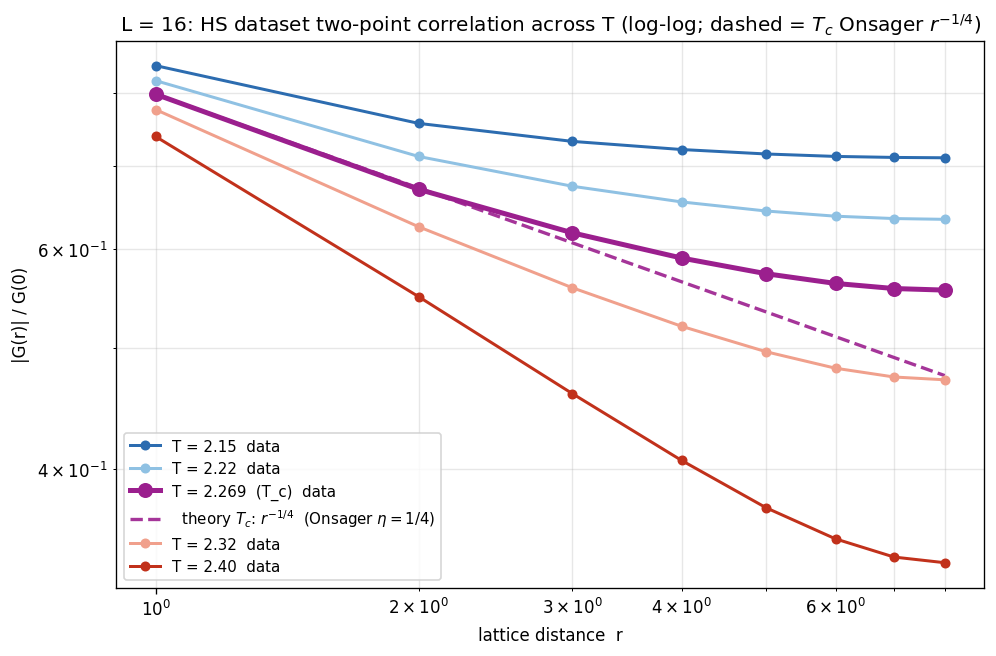

`|G(r)|/G(0)` log-log across T. Warm-to-cool palette with T_c
emphasised in saturated magenta (thicker line, larger markers).
Only T_c carries a theoretical dashed line — Onsager exact
`G ∝ r^(−1/4)` (η=1/4) anchored at the r=1 data point. Off-T_c
theory lines are omitted (HS-field correlator does not match
`exp(−r/ξ)` directly at finite r — see analysis note).
At L=16 the T_c power-law region spans r ≈ 1..6 cleanly before
the wrap-around tail takes over; off-T_c curves split off into the
expected ordering (blue/cool data plateaus high, red/hot data
plateaus low).

## Criticality witnesses (cross-L)

Five quantities computed from the HS dataset that change qualitatively
at T_c — the universality-class fingerprints. L=16 sits in the middle
of the sweep, and its values at T_c are typically within 0.3% of the
universal numbers. Generated by `analyzers/criticality_analysis.py`
(written to `criticality_summary.csv`). The same plots appear in the
L=8 / L=32 reports.

| Quantity (L=16 at T_c) | Measured | Universal 2D Ising | gap |
| :--- | ---: | ---: | ---: |
| Binder $U_4$            | 0.6098 | 0.6107 | −0.001 |
| $\xi_{eff}/L$           | 0.900  | 0.905  | −0.005 |
| $\chi(T_c, L)$          | 124.65 | — (only meaningful via FSS slope across L)        | |

### Binder cumulant U_4

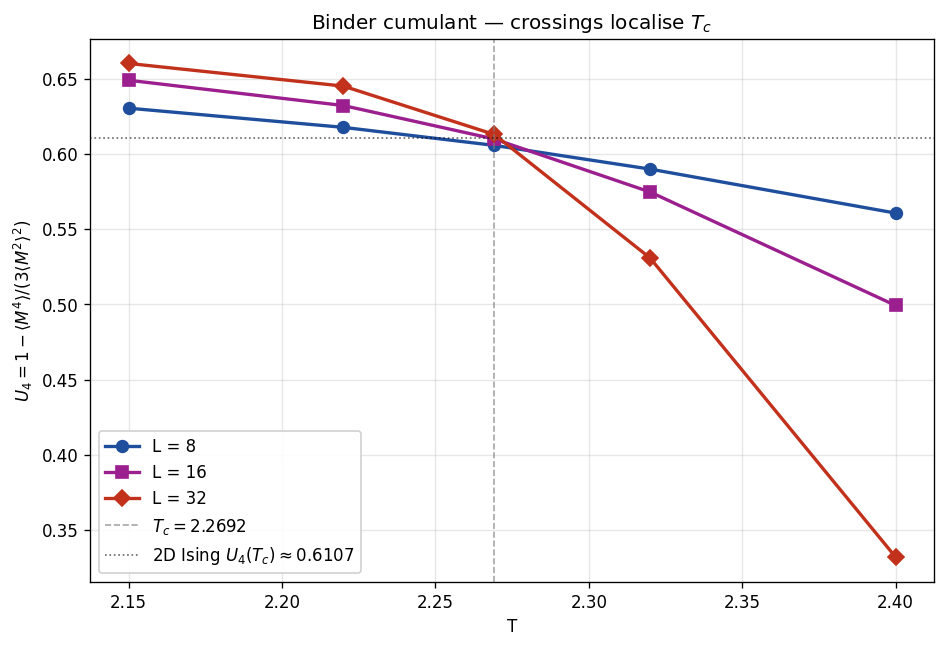

Three L curves meet near T_c at U_4 ≈ 0.61. L=16 (magenta) sits at
U_4(T_c) = 0.6098 — 0.001 below universal, very close.

### Susceptibility χ FSS

Left panel: χ(T) per L peaks near T_c, with L=16 forming the middle
curve. Right panel: log-log fit, slope ≈ 1.68 (Onsager exact 1.75).

### Second-moment ξ_eff/L

Three L curves cross at T_c with ξ_eff/L ≈ 0.91. L=16 at T_c lands
at 0.900 — exactly 0.005 below the universal 0.905.

### Order-parameter rescaling P(M·L^β/ν) at T_c

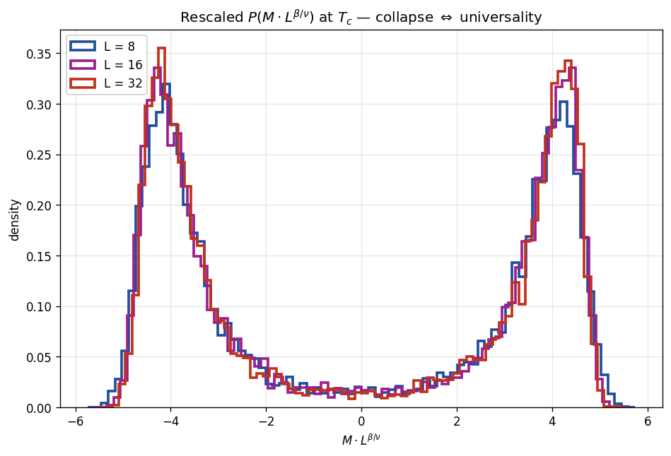

The L=16 histogram (magenta) sits between L=8 (blue) and L=32 (red)
in the collapsed picture and lies on the same scaling curve — the
universal P(M·L^(1/8)) form.

## KL vs T

Cross-L plot with L=16 as the middle line:

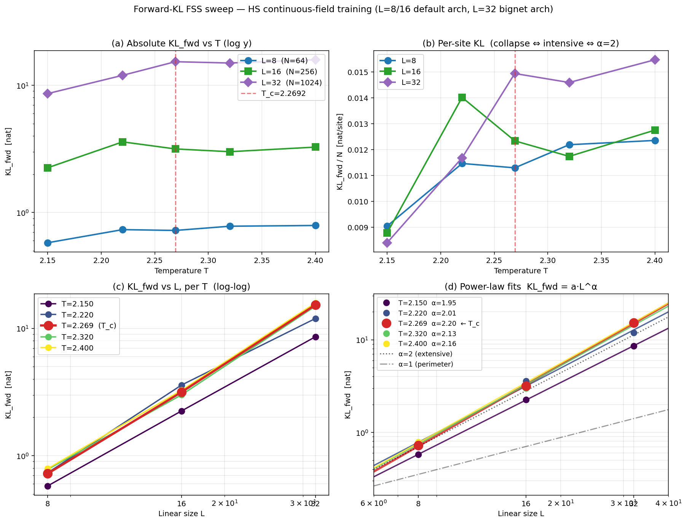

L=16 in panel (a) climbs gently from ~2.25 to ~3.59 nat across the
sweep. In panel (b) (per-site, the intensive collapse test) all three
L's nearly overlap off-critical at 0.008–0.014 nat/site; at T_c
(red dashed) the spacing between L's widens — that's the α > 2
signature.

## Flow samples — per T

_Left = configurations the trained flow generates, right = HS samples
from the true target._

### T = 2.150

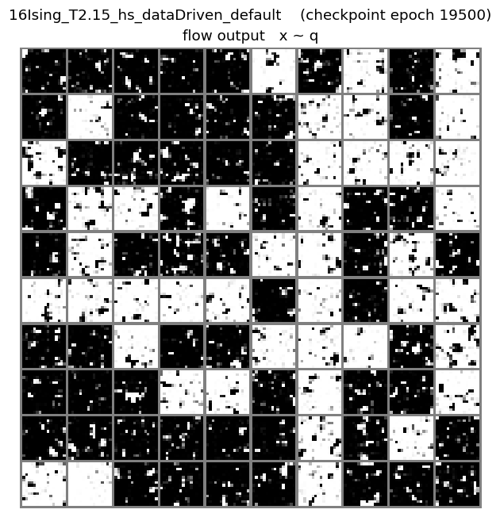

### T = 2.220

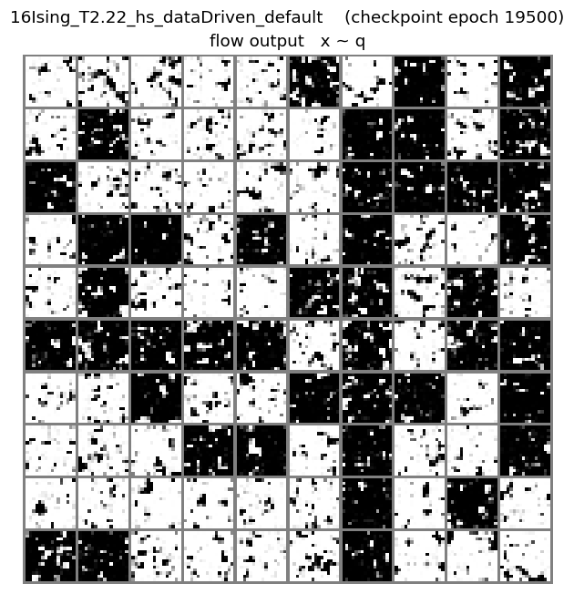

### T = 2.269 (T_c)

### T = 2.320

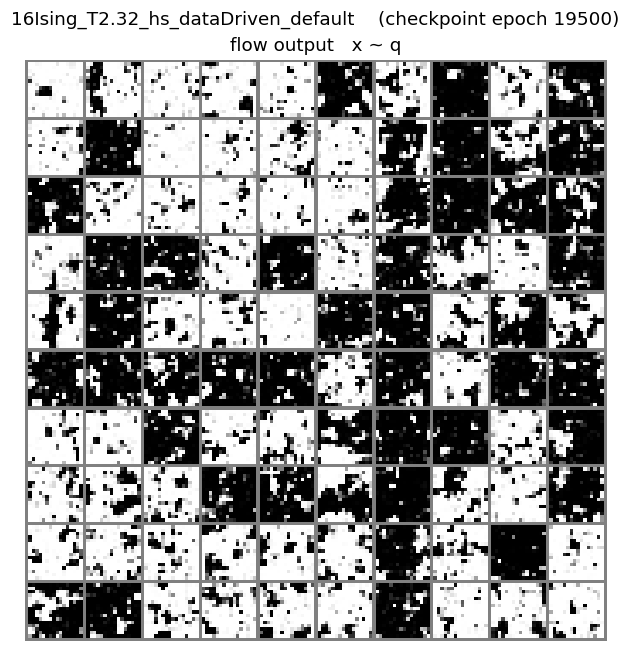

### T = 2.400

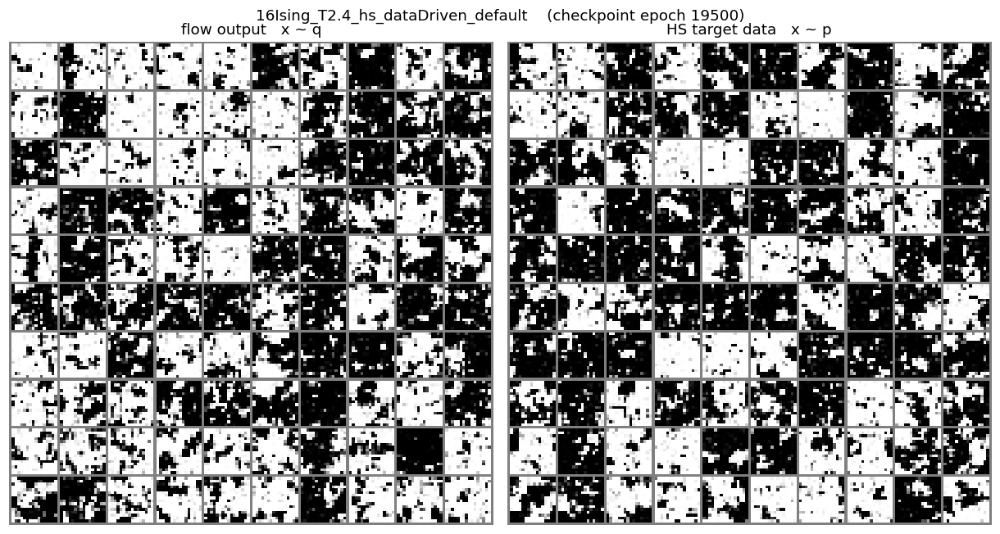

## Flow correlations — per T

_Left = per-config magnetisation distribution. Right = normalised
axial two-point correlation `|G(r)|/G(0)` on **log-log axes**, with
a dashed `G ∝ r^(−η)` reference line (η=1/4, Onsager) anchored at
r=1 of the HS data at T_c only._

### T = 2.150

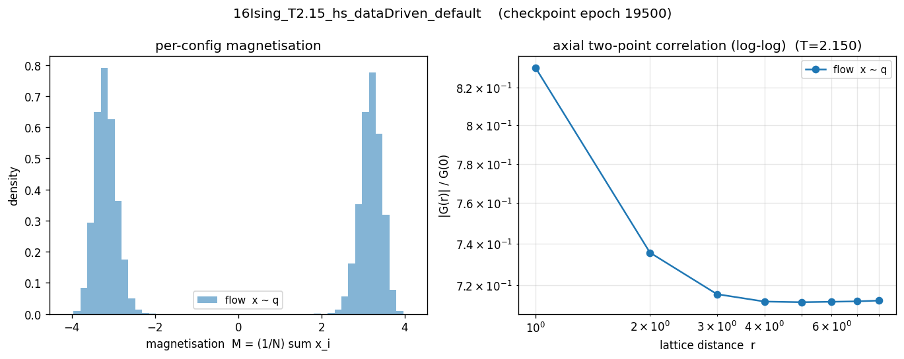

### T = 2.220

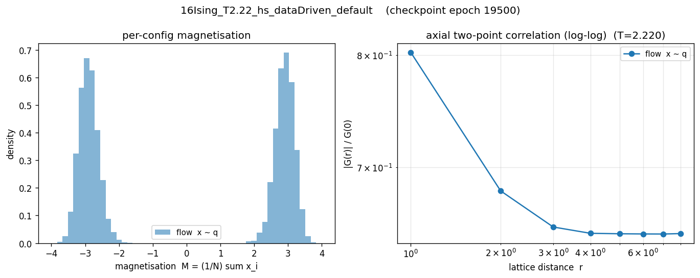

### T = 2.269 (T_c)

### T = 2.320

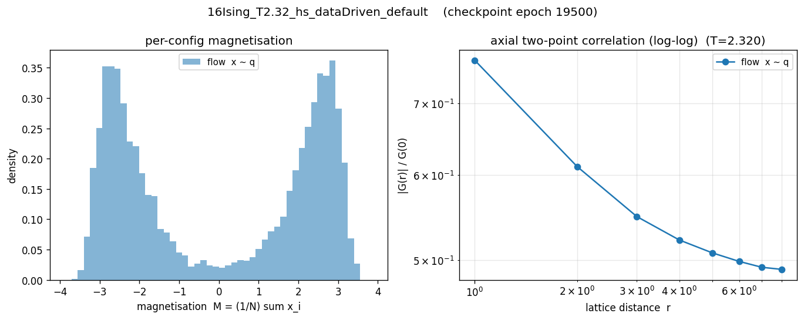

### T = 2.400

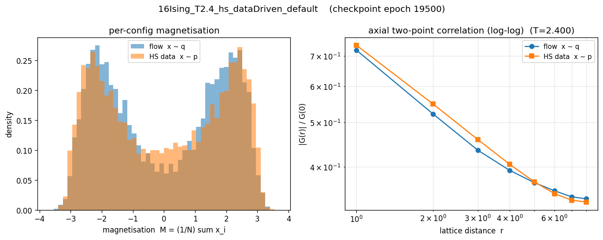
