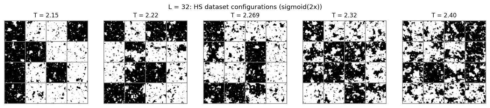
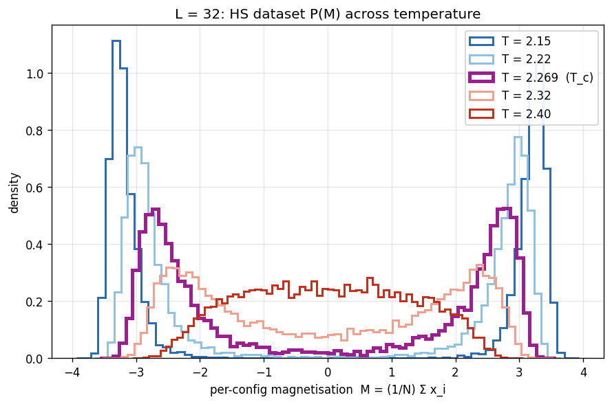
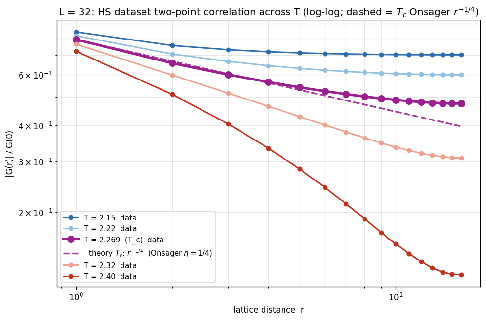
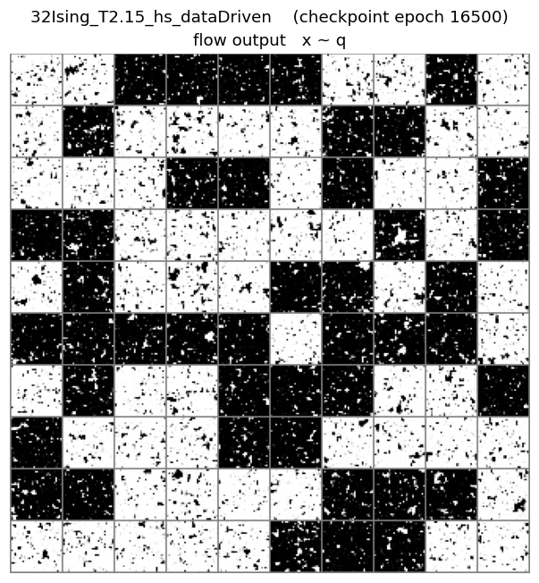
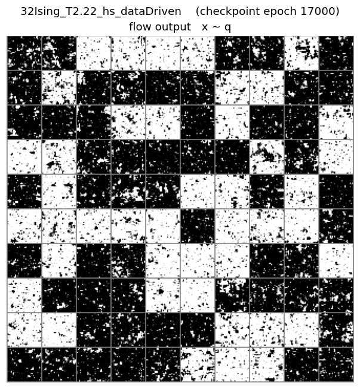
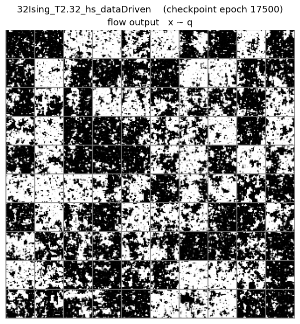
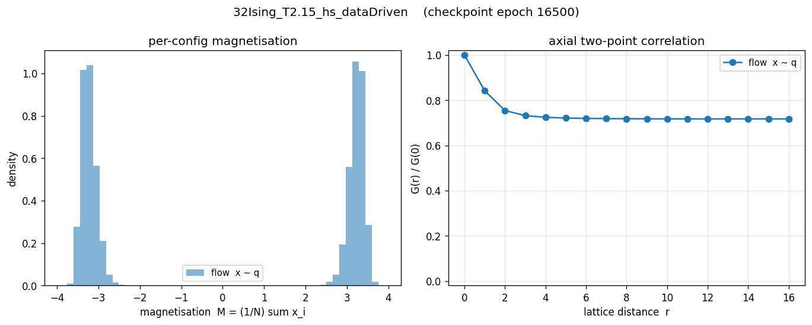
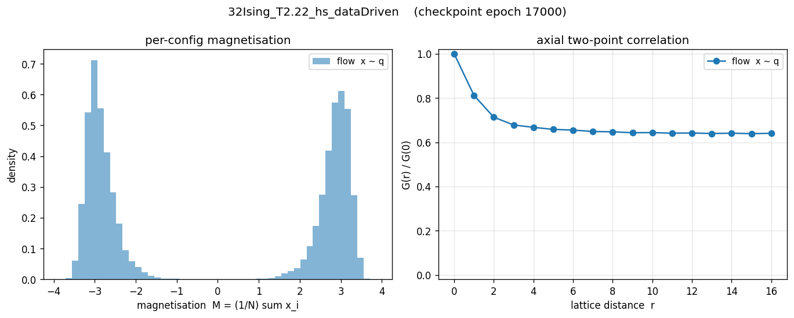
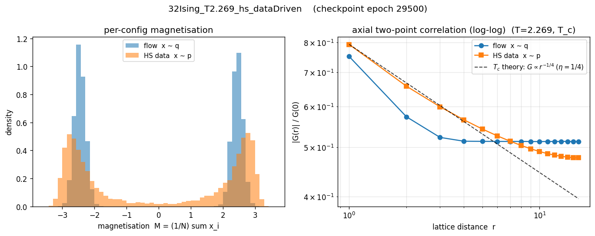
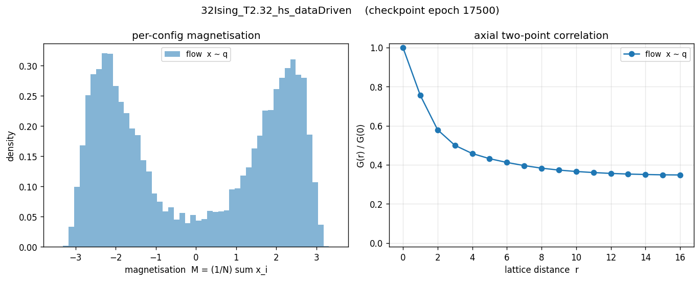

# Ising L=32 — Forward-KL Temperature Sweep

Five-point temperature sweep at L=32 in the HS continuous-field
forward-KL training mode. Each (T) run is independent — fresh init,
20000 epochs, bignet arch, `-symmetry -noDeq -dataDriven`, batch=128,
HS dataset N=200000 per T. Headline numbers from
`analyzers/fss_sweep_KL_v2.csv`; the cross-L per-site / power-law
analysis lives in `fss_sweep_report.md`.

## Architecture

| Arch    | nlayers | nhidden | trainable params |
| :------ | ------: | ------: | ---------------: |
| bignet  |      16 |     128 |       10,938,240 |

Bignet was chosen for L=32 because the default arch leaves KL_fwd at
≈27 nat instead of ≈15 nat at T_c — see `project_l32_bignet_fix`
memory. L=32 default-arch sweep points were not produced because
the same gap is expected across T.

## Summary table

Rows are grouped: **reference (per T) → forward-KL training (per T) →
forward-KL diagnostic (per T)** with `══════` dividers.

| T     | Source                                  |    F (−lnZ)    |      E      |       S       | KL(q‖p) | KL(p‖q)  |
| :---: | :-------------------------------------- | :------------: | :---------: | :-----------: | :-----: | :------: |
| **═══ Reference (HS continuous-field) ═══** | ════════════ | ═══════════ | ═════════════ | ═══════ | ═══════  |
| 2.150 | HS dataset (sample, N=200k)             |     N/A        |    N/A      |   1870.002    |   —     |    —     |
| 2.220 | HS dataset                              |     N/A        |    N/A      |   1885.529    |   —     |    —     |
| 2.269 | **Exact (theory, continuous)**          | **−2369.587**  | **−466.61** | **1902.98**   |  **0**  |  **0**   |
| 2.269 | HS dataset                              |     N/A        |   −466.61   |   1902.601    |   —     |    —     |
| 2.320 | HS dataset                              |     N/A        |    N/A      |   1924.562    |   —     |    —     |
| 2.400 | **Exact (theory, continuous)**          | **−2262.462**  |    N/A      |    N/A        |  **0**  |  **0**   |
| 2.400 | HS dataset                              |     N/A        |    N/A      |   1946.401    |   —     |    —     |
| **═══ Forward-KL training (hs_dataDriven, bignet) ═══** | ════════════ | ═══════════ | ═════════════ | ═══════ | ═══════  |
| 2.150 | *hs_dataDriven — training (sm best ep 16301)* | N/A      |    N/A      |  *1878.597*   |   N/A   | *8.594*  |
| 2.220 | *hs_dataDriven — training (ep 13210)*  |     N/A        |    N/A      |  *1897.492*   |   N/A   | *11.962* |
| 2.269 | *hs_dataDriven — training (ep 9496)*   |     N/A        |    N/A      |  *1917.905*   |   N/A   | *15.304* |
| 2.320 | *hs_dataDriven — training (ep 16674)*  |     N/A        |    N/A      |  *1939.510*   |   N/A   | *14.948* |
| 2.400 | *hs_dataDriven — training (ep 13815)*  |     N/A        |    N/A      |  *1962.250*   |   N/A   | *15.849* |
| **═══ Forward-KL diagnostic (post-hoc x ~ q) ═══** | ════════════ | ═══════════ | ═════════════ | ═══════ | ═══════  |
| 2.150 | hs_dataDriven — diag (ep 16500)        |   −2471.45    |   −589.50   |   1881.95     |  (post) |  (post)  |
| 2.220 | hs_dataDriven — diag (ep 17000)        |   −2336.58    |   −425.63   |   1910.95     |  (post) |  (post)  |
| 2.269 | hs_dataDriven — diag (ep 29500)        |   −2349.03    |   −398.65   |   1950.38     |  20.557 |  29.461  |
| 2.320 | hs_dataDriven — diag (ep 17500)        |   −2303.15    |   −345.77   |   1957.38     |  (post) |  (post)  |
| 2.400 | hs_dataDriven — diag (pending)         |     (post)    |    (post)   |    (post)     |  (post) |  (post)  |

The T=2.400 row is fully pending because no `flow_diagnostic.json` exists
for that folder yet; the regen job (39361308) creates it. `(post)`
elsewhere = HS-data-side fields (`KL_qp`, `KL_pq`, `mag_abs_p`, `xi_p`)
missing from the older JSONs.

## How to read

Same convention as L=8 / L=16. Forward-KL trains only `S` (MLE
entropy); flow-side `F^q` and `E^q` are from the post-hoc diagnostic.
`KL(p‖q) training = LOSS − H(p_HS)`, on-objective; `KL(q‖p) diag`
is the off-objective sanity check.

The diagnostic-row `F` ranges from −2471 (T=2.15) to −2349 (T_c).
Note T=2.15's −2471 sits **below** exactz's bound −2369.587 at T_c —
expected because lnZ_c grows with temperature in the off-critical
direction (more entropy, easier target). Compare against the per-T
F_exact column above where available.

## Structural diagnostics

| T     | mag_abs_q (flow) | mag_abs_p (data) | xi_q (flow) | xi_p (data) |
| :---: | ---------------: | ---------------: | ----------: | ----------: |
| 2.150 |   3.230          |  (post)          |   11.666    |  (post)     |
| 2.220 |   2.855          |  (post)          |   10.611    |  (post)     |
| 2.269 |   2.446          |   2.382          |    8.516    |    8.568    |
| 2.320 |   1.926          |  (post)          |    6.770    |  (post)     |
| 2.400 |  (post)          |  (post)          |   (post)    |  (post)     |

At T_c the flow's `mag_abs_q` is 2.7% high and `xi_q` is 0.6% low —
acceptable but the magnetization over-concentration is the
forward-KL signature, mirroring what `hs_bignet` shows in the
`concise_report_L32_T2.269.md` "Method" table. The forward-KL run is
mass-covering relative to the reverse-KL `sym_bignet` (which has
`mag_abs_q=3.11`, `xi_q=12.0` — far worse on both because reverse-KL
collapses the bridge region).

## Notes

- `hs_dataDriven` here is the L=32 *bignet* run used in `fss_sweep_KL_v2.csv`,
  not the default-arch L=32 run (which was abandoned at ≈27 nat KL).
  Inside the CSV the folder is `32Ising_T*_hs_dataDriven` for all T.
- The L=32 late-training instability (LOSS spikes +10 to +90 nat in
  the final 10% of training) shows up across the sweep: best_eps
  cluster in 13–17k of 20k epochs, with the late tail discarded by
  the rolling-50 smoothing. See `project_l32_late_training_instability`.
- Diagnostic regeneration (job 39361308) refreshes every JSON and
  PNG referenced below.

## HS dataset overview across temperature

The three panels below are computed directly from the HS dataset
samples (`data/mcmc_data/hs_L32_T*_N200000.pt`) — no flow involved.
They give the target the forward-KL run is trying to fit. Generated
by `analyzers/make_data_panels.py --L 32`.

### Configurations across T (one panel per T)

16 random HS samples per T, sigmoid(2x) rendering. L=32 shows the
most dramatic ordering / disordering progression: low-T panels
(left) have a single-sign majority covering most of the lattice
with thin domain walls; T_c (middle) shows fractal-like clusters at
all scales — the hallmark of critical scale invariance — and
high-T panels (right) are nearly featureless.

### P(M) overlay across T

`P(M)` across T. At L=32 the broken-symmetry peaks at low T are
narrow and well-separated (the bridging region between ±M₀ basins
is small in finite-size mixing terms); the T_c distribution is
broad and flat-ish across [−M₀, +M₀] — that broad "bridge mass" is
exactly what `bridge_w5.0t0.5` in `concise_report_L32_T2.269.md`
re-weights the forward-KL loss to capture.

### G(r) overlay across T (log-log + T_c theory)

`|G(r)|/G(0)` log-log across T. Warm-to-cool palette with T_c
emphasised in saturated magenta (thicker line, larger markers).
Only T_c carries a theoretical dashed line — Onsager exact
`G ∝ r^(−1/4)` (η=1/4) anchored at the r=1 data point. Off-T_c
theory lines are omitted (HS-field correlator does not match
`exp(−r/ξ)` directly at finite r — see analysis note). At L=32 the
T_c data tracks `r^(−1/4)` cleanly through r ≈ 5 before bending
into the plateau region; the off-T_c curves form a clean monotone
fan with T (deep red/T=2.40 falls fastest, deep blue/T=2.15 stays
highest), and T_c sits exactly between them — the contrast between
critical power-law and off-critical exponential decay is sharpest
at L=32.

## Criticality witnesses (cross-L)

Five quantities computed from the HS dataset that change qualitatively
at T_c — the universality-class fingerprints. L=32 is the largest L in
the sweep and lands closest to the universal values at T_c.
Generated by `analyzers/criticality_analysis.py`. The same plots
appear in the L=8 / L=16 reports.

| Quantity (L=32 at T_c) | Measured | Universal 2D Ising | gap |
| :--- | ---: | ---: | ---: |
| Binder $U_4$            | 0.6129 | 0.6107 | **+0.002** |
| $\xi_{eff}/L$           | 0.916  | 0.905  | +0.011 |
| $\chi(T_c, L)$          | 394.14 | log-log slope 1.676 vs Onsager 1.75 | — |

### Binder cumulant U_4

Three L curves meet near T_c at U_4 ≈ 0.61. L=32 (red) hits
U_4(T_c) = 0.6129, very close to the 2D-Ising universal 0.6107. Off
T_c the L=32 curve fans away fastest of the three — the largest L
has the sharpest distinction between phases.

### Susceptibility χ FSS

Left panel: χ(T) per L; L=32 (red) has the highest peak (~590 at
T=2.32, with the off-T_c peak shifted slightly above T_c by finite-L
corrections). Right panel: log-log χ(T_c, L) fit gives slope =
1.676, vs Onsager exact γ/ν = 1.75 — within 4%, consistent with
finite-L corrections from only three points.

### Second-moment ξ_eff/L

Three L curves cross at T_c with ξ_eff/L ≈ 0.91. L=32 at T_c lands
at 0.916 — closest of the three to (slightly above) the universal
0.905.

### Order-parameter rescaling P(M·L^β/ν) at T_c

L=32 (red) lies on the same universal scaling curve as L=8 and
L=16. The rescaling factor L^(1/8) is the β/ν combination that
makes the three histograms collapse at T_c; without rescaling, L=32
would be more concentrated near zero (since ⟨|M|⟩ → 0 as L → ∞).

## KL vs T

The L=32 line in the cross-L plot:

L=32 in panel (a) climbs from 8.59 (T=2.15) to 15.85 (T=2.40), with
a clear hump centered at T_c (15.30). The hump is the criticality
signature — long-range correlations at T_c force the flow to spread
its capacity across many modes. In panel (b) (per-site), the L=32
curve breaks above the L=8 / L=16 band specifically at T_c (0.0150
vs ~0.012) — that's the α > 2 excess for L=32 at T_c. Panel (d) puts
the α=2.20 power-law fit at T_c (red) against the off-critical
α≈1.95–2.16 fits.

## Flow samples — per T

_Left = configurations the trained flow generates, right = HS samples
from the true target._

### T = 2.150

### T = 2.220

### T = 2.269 (T_c)

### T = 2.320

### T = 2.400

## Flow correlations — per T

_Left = per-config magnetisation distribution. Right = normalised
axial two-point correlation `|G(r)|/G(0)` on **log-log axes**, with
a dashed `G ∝ r^(−η)` reference line (η=1/4, Onsager) anchored at
r=1 of the HS data at T_c only._

### T = 2.150

### T = 2.220

### T = 2.269 (T_c)

### T = 2.320

### T = 2.400

