# Ising L=8 — Forward-KL Temperature Sweep

Five-point temperature sweep at L=8 in the HS continuous-field
forward-KL training mode. Each (T) run is independent — fresh
init, 20000 epochs, default arch, `-symmetry -noDeq -dataDriven`,
batch=128, HS dataset N=200000 per T. Headline numbers from
`analyzers/fss_sweep_KL_v2.csv`; the cross-L per-site / power-law
analysis lives in `fss_sweep_report.md`.

## Architecture

| Arch    | nlayers | nhidden | trainable params |
| :------ | ------: | ------: | ---------------: |
| default |      10 |      64 |        1,068,240 |

Default arch saturates at L=8 — bignet would not help, see
`fss_sweep_report.md`.

## Summary table

Rows are grouped: **reference (per T) → forward-KL training (per T) →
forward-KL diagnostic (per T)** with `══════` dividers. Numbers in
nats; *italic* = training-row HDF5 read, plain = sample-side
diagnostic, **bold** = exact theory.

| T     | Source                                  |    F (−lnZ)     |      E      |       S       | KL(q‖p) | KL(p‖q)  |
| :---: | :-------------------------------------- | :-------------: | :---------: | :-----------: | :-----: | :------: |
| **═══ Reference (HS continuous-field) ═══** |  ════════════ | ═══════════ | ═════════════ | ═══════ | ═══════  |
| 2.150 | HS dataset (sample, N=200k)             |      N/A        |    N/A      |   117.2218    |   —     |    —     |
| 2.220 | HS dataset                              |      N/A        |    N/A      |   117.7082    |   —     |    —     |
| 2.269 | **Exact (theory, continuous)**          |  **−148.6550**  | **−30.3860**| **118.2690**  |  **0**  |  **0**   |
| 2.269 | HS dataset                              |      N/A        |   −30.3860  |   118.2690    |   —     |    —     |
| 2.320 | HS dataset                              |      N/A        |    N/A      |   118.6453    |   —     |    —     |
| 2.400 | **Exact (theory, continuous)**          |  **−141.7742**  |    N/A      |    N/A        |  **0**  |  **0**   |
| 2.400 | HS dataset                              |      N/A        |    N/A      |   119.3774    |   —     |    —     |
| **═══ Forward-KL training (hs_dataDriven) ═══** | ════════════ | ═══════════ | ═════════════ | ═══════ | ═══════  |
| 2.150 | *hs_dataDriven — training (sm best ep 19452)* |  N/A      |    N/A      |  *117.8003*   |   N/A   | *0.5785* |
| 2.220 | *hs_dataDriven — training (ep 17716)*  |      N/A        |    N/A      |  *118.4418*   |   N/A   | *0.7336* |
| 2.269 | *hs_dataDriven — training (ep 16014)*  |      N/A        |    N/A      |  *118.8462*   |   N/A   | *0.7228* |
| 2.320 | *hs_dataDriven — training (ep 16400)*  |      N/A        |    N/A      |  *119.4254*   |   N/A   | *0.7801* |
| 2.400 | *hs_dataDriven — training (ep 18953)*  |      N/A        |    N/A      |  *120.1681*   |   N/A   | *0.7907* |
| **═══ Forward-KL diagnostic (post-hoc x ~ q) ═══** | ════════════ | ═══════════ | ═════════════ | ═══════ | ═══════  |
| 2.150 | hs_dataDriven — diag (ep 19500)        |    −154.475    |   −35.903   |   118.572     |  (post) |   (post) |
| 2.220 | hs_dataDriven — diag (ep 19500)        |    −149.912    |   −30.424   |   119.488     |  (post) |   (post) |
| 2.269 | hs_dataDriven — diag (ep 27000)        |    −147.294    |   −27.375   |   119.918     |  1.361  |   0.957  |
| 2.320 | hs_dataDriven — diag (ep 19500)        |    −144.058    |   −23.515   |   120.544     |  (post) |   (post) |
| 2.400 | hs_dataDriven — diag (ep 19500)        |    −140.283    |   −18.722   |   121.561     |  1.491  |   1.048  |

`(post)` = needs the post-T_c re-diagnostic (job 39361308) to pick up
the HS-data-side fields (`KL_qp`, `KL_pq`, `Hp_mc`, `mag_abs_p`,
`xi_p`). Existing JSONs for off-T_c L=8 points were generated before
the HS dataset was linked into the diagnostic and so only carry the
flow-side numbers.

## How to read

For the forward-KL HS data-driven runs, only the `S` column is
training-measurable (= the MLE loss `−E_data[log q]`). The flow-side
`F^q = E_q[A] − H(q)` and `E^q = E_q[A]` columns come from the
post-hoc diagnostic that draws fresh samples `x ~ q` from the trained
flow. `KL(p‖q) training = LOSS − H(p_HS)` is the on-objective number;
`KL(q‖p) diag` is the off-objective sanity check (training cannot see
it).

## Structural diagnostics — `mag_abs` and `xi`

Both columns are post-hoc statistics. `mag_abs = E[|M|]` where
`M = (1/N) Σᵢ xᵢ` is the per-config mean of the continuous field.
`xi = Σᵣ G(r)/G(0)` along the lattice axis is the effective
correlation length on the HS field. See
`concise_report_L32_T2.269.md` for the long version of these
definitions and the reverse-KL "over-sharpening" interpretation.

| T     | mag_abs_q (flow) | mag_abs_p (data) | xi_q (flow) | xi_p (data) |
| :---: | ---------------: | ---------------: | ----------: | ----------: |
| 2.150 |   3.222          |  (post)          |   3.064     |  (post)     |
| 2.220 |   2.923          |  (post)          |   2.887     |  (post)     |
| 2.269 |   2.839          |   2.811          |   2.820     |   2.826     |
| 2.320 |   2.542          |  (post)          |   2.631     |  (post)     |
| 2.400 |   2.281          |   2.340          |   2.406     |   2.490     |

The two fully-populated rows (T=2.269, T=2.400) both show
`mag_abs_q ≈ mag_abs_p` and `xi_q ≈ xi_p` to within ~3%. At L=8
the default-arch flow tracks data structure closely; the per-site KL
~0.011 nat/site (see `fss_sweep_report.md`) is genuinely small.

## Notes

- `H(p_HS)` is an MC estimate from N=200000 HS samples; absolute
  values agree with exact theory to ~3 decimals at the two T's where
  exactz.md has a row (T=2.269185, T=2.400).
- The `best_ep` column shows the epoch where the rolling-50 LOSS was
  minimum. With 20000 training epochs, all best-eps fall in the
  middle/late portion (16k–19k) — none of the runs were still
  diverging at the end, and none had converged in the first quarter
  either.
- Diagnostic regeneration (job 39361308) will refresh `flow_diagnostic.json`
  and the PNGs below with the current code, including HS-side
  `mag_abs_p` / `xi_p` / `KL_qp` / `KL_pq` for all five T's.

## HS dataset overview across temperature

The three panels below are computed directly from the HS dataset
samples (`data/mcmc_data/hs_L8_T*_N200000.pt`) — no flow involved.
They give the target the forward-KL run is trying to fit. Generated
by `analyzers/make_data_panels.py --L 8`.

### Configurations across T (one panel per T)

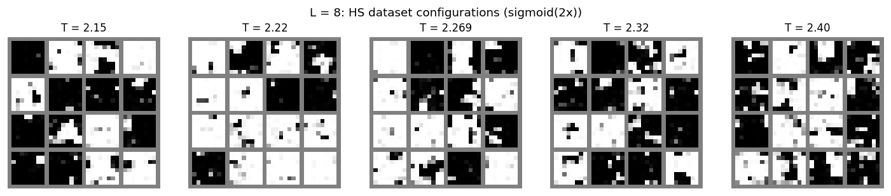

Each panel: 16 randomly drawn HS samples at that T, rendered as
sigmoid(2x). Visible trend: ordered ±-sign domains shrink as T
crosses T_c upward; high-T panels (right) look like uncorrelated
noise. Low-T panels (left) show large monochromatic patches — the
broken-symmetry phase.

### P(M) overlay across T

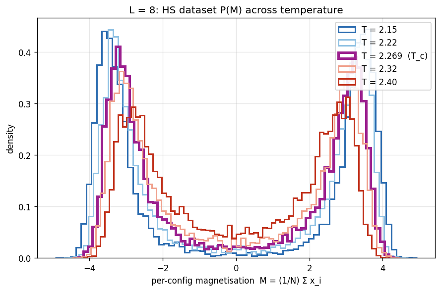

Per-config magnetisation `M = (1/N) Σᵢ xᵢ` histogrammed per T, all on
the same axes with `coolwarm` colors (blue = cool/ordered, red =
hot/disordered). At low T the distribution is bimodal at ±M₀; at
high T it collapses to a Gaussian centered at 0. T_c sits at the
crossover.

### G(r) overlay across T (log-log + T_c theory)

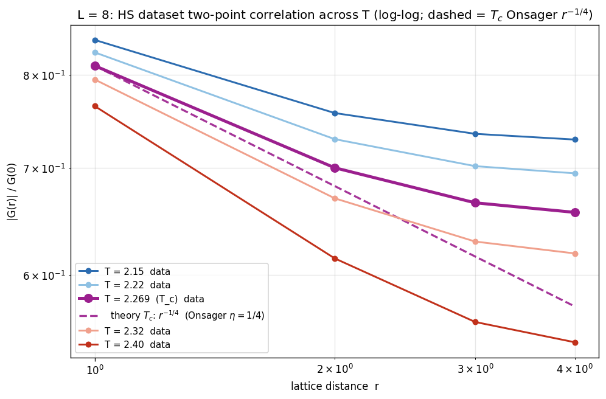

Axial normalised two-point correlation `|G(r)|/G(0)` on log-log
axes, all T's overlaid. Colors run warm-to-cool with T_c emphasised
in saturated magenta (thicker line, larger markers) so the critical
curve is unambiguous against the blue/red flanks. Only T_c carries
a theoretical dashed line — Onsager exact `G ∝ r^(−1/4)` (η=1/4),
no fitting, anchored at the r=1 data point. Off-T_c theory lines
are omitted because the HS-field correlator `⟨x_0 x_r⟩` does not
match Onsager's spin-correlator `exp(−r/ξ)` at finite r without
either the Ornstein-Zernike `1/√r` correction or the full
convolution with the HS coupling K; see the analysis note above
the report-update section. At L=8 only r=1..4 are accessible, and
the apparent decay is dominated by finite-L wrap-around.

## Criticality witnesses (cross-L)

Five quantities computed from the HS dataset that change qualitatively
at T_c — the universality-class fingerprints. All five include L=8 as
the smallest size in the sweep; deviations from the universal values
are largest here. Generated by `analyzers/criticality_analysis.py`
(written to `criticality_summary.csv`). The same plots appear in
`temp_sweep_L16.md` and `temp_sweep_L32.md`.

| Quantity (L=8 at T_c) | Measured | Universal 2D Ising | gap |
| :--- | ---: | ---: | ---: |
| Binder $U_4$            | 0.6056 | 0.6107 | −0.005 |
| $\xi_{eff}/L$           | 0.897  | 0.905  | −0.008 |
| $\chi(T_c, L)$          | 38.58  | — (only meaningful via FSS slope across L)        | |

### Binder cumulant U_4

Three L curves meet near T_c at U_4 ≈ 0.61 (universal value 0.6107).
Below T_c they fan upward toward 2/3 (bimodal limit), above toward 0
(Gaussian limit). L=8 (blue) sits slightly below the universal value
at T_c — typical finite-size correction.

### Susceptibility χ FSS

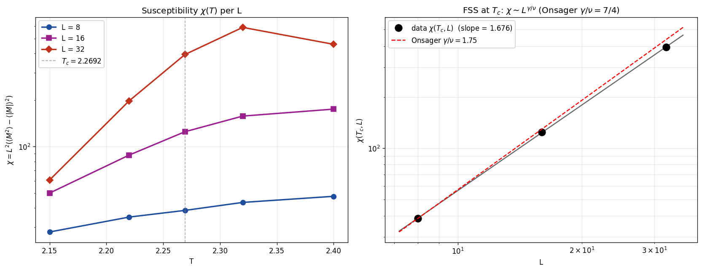

Left panel: χ(T) per L peaks near T_c. Right panel: log-log
χ(T_c, L) — measured slope ≈ 1.68 vs Onsager exact γ/ν = 1.75. L=8 is
the lowest data point on the log-log plot.

### Second-moment ξ_eff/L

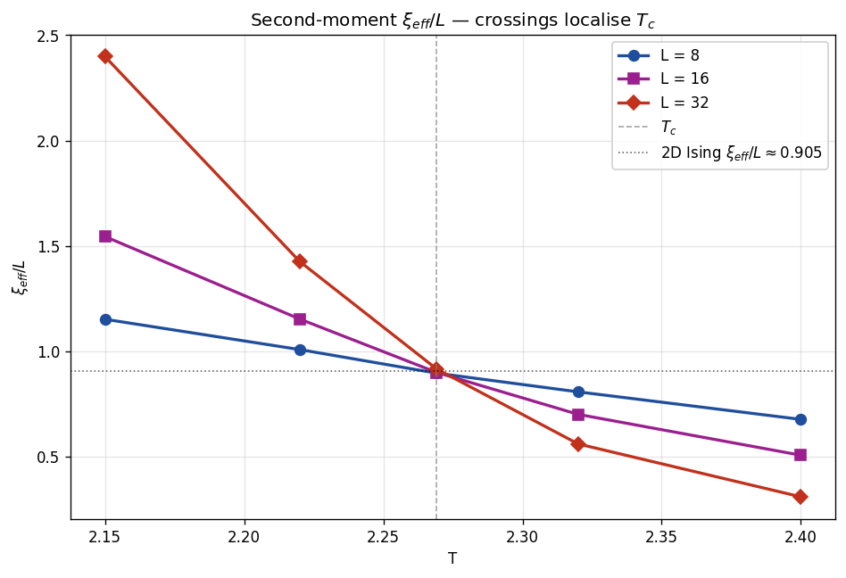

Three L curves cross at T_c with ξ_eff/L ≈ 0.91 (universal 0.905).
L=8 (blue) at T_c lands at 0.897 — within 1% of universal.

### Order-parameter rescaling P(M·L^β/ν) at T_c

P(M·L^(1/8)) at T_c for L=8/16/32 — three histograms overlay on a
single curve. This collapse exists only at T_c; off-T_c the same
rescaling would not collapse the curves.

## KL vs T

The cross-L picture, including the L=8 line:

The L=8 line sits near-flat in 0.58–0.79 nat across the full sweep —
the structural diagnostics above show L=8 already tracks data well
at every T. The per-site KL plot (panel b) shows L=8 / L=16 / L=32 nearly
collapsing off-critical (per-site KL is intensive away from T_c) and
breaking apart at T_c (panel d, α=2.20 fit).

## Flow samples — per T

_Left = configurations the trained flow generates, right = HS samples
from the true target. Same sigmoid(2x) rendering._

### T = 2.150

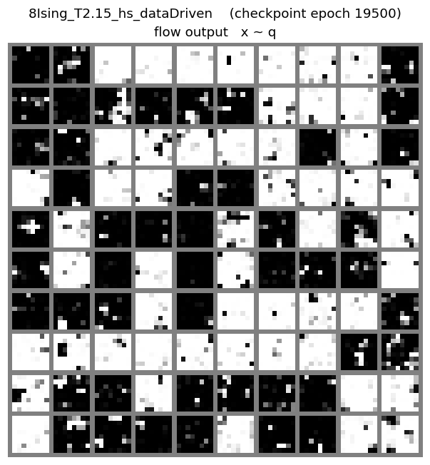

### T = 2.220

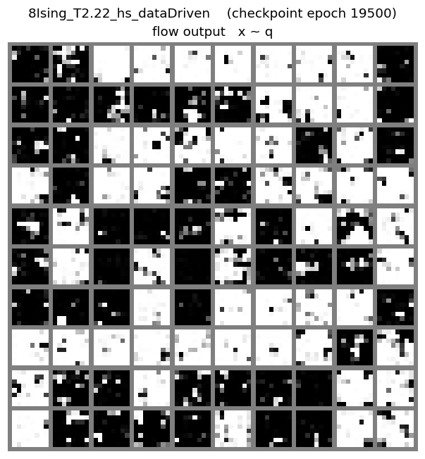

### T = 2.269 (T_c)

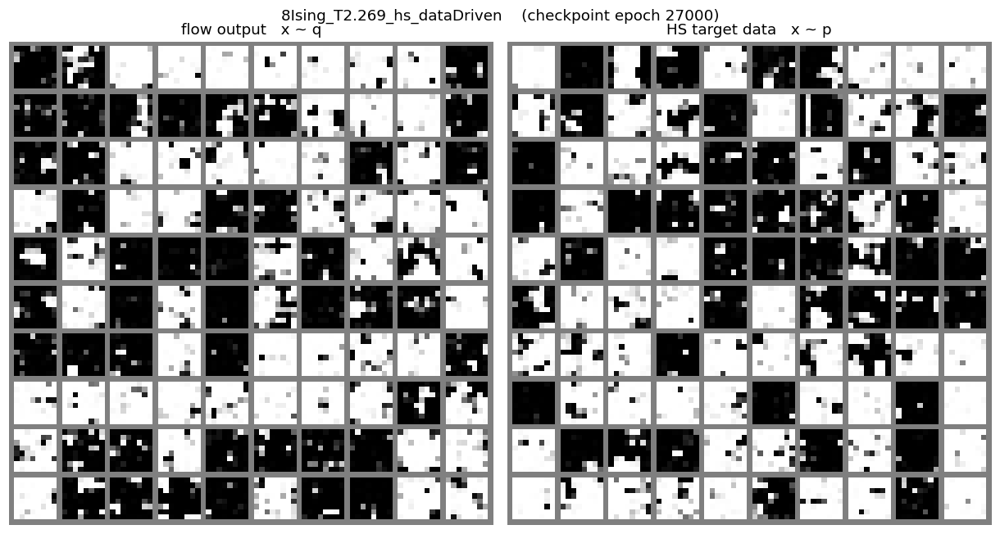

### T = 2.320

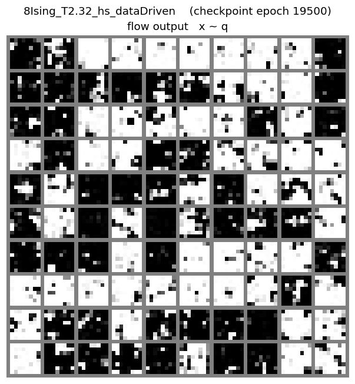

### T = 2.400

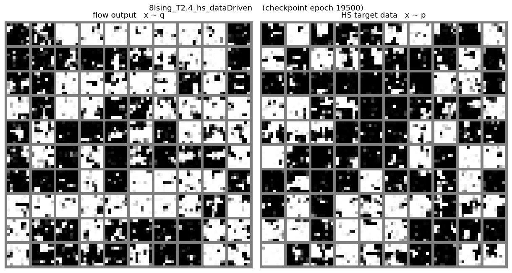

## Flow correlations — per T

_Left = per-config magnetisation distribution. Right = normalised
axial two-point correlation `|G(r)|/G(0)` on **log-log axes**, with a
dashed `G ∝ r^(−η)` reference line (η=1/4, Onsager) anchored at r=1
of the HS data._

### T = 2.150

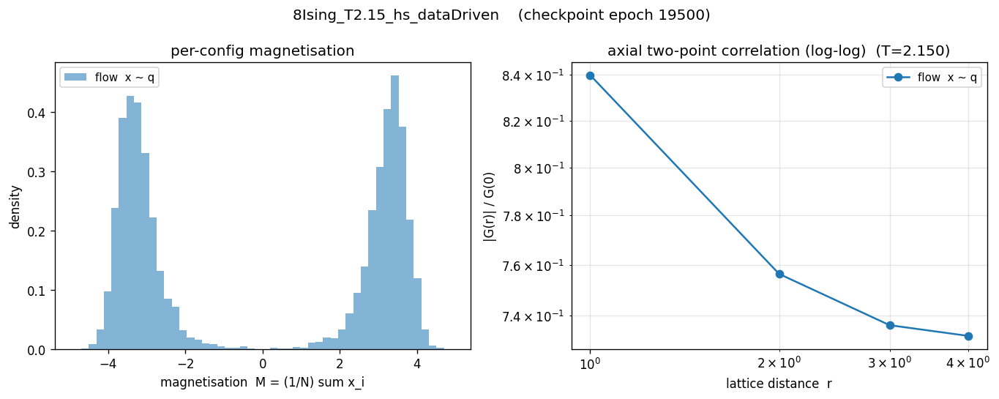

### T = 2.220

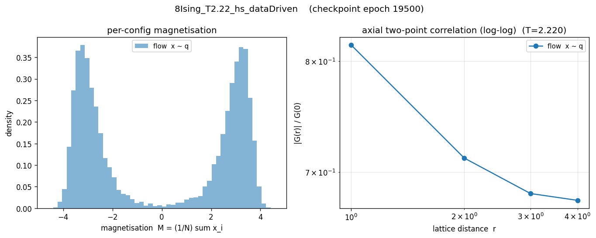

### T = 2.269 (T_c)

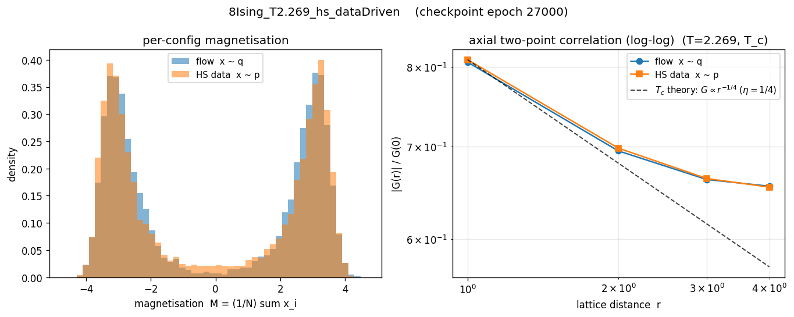

### T = 2.320

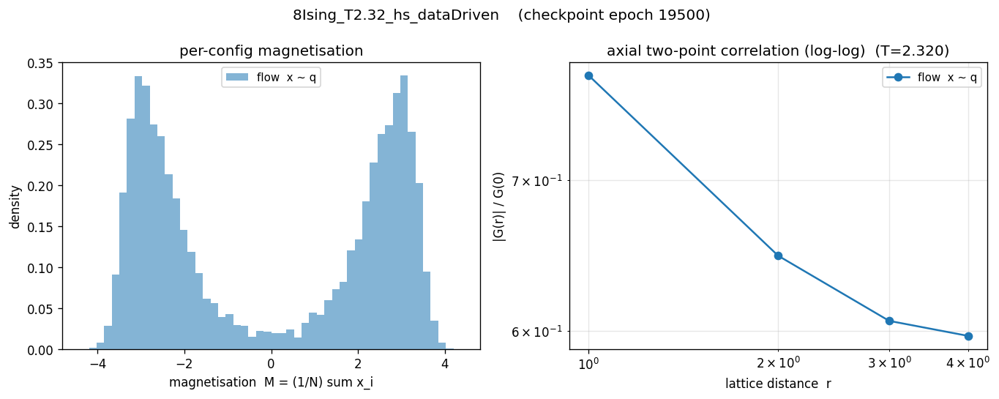

### T = 2.400

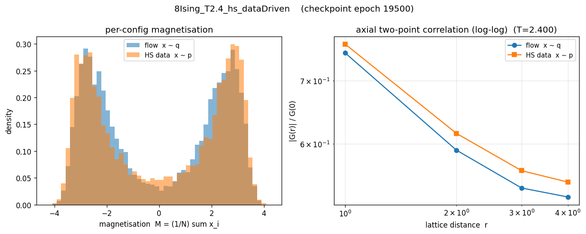
